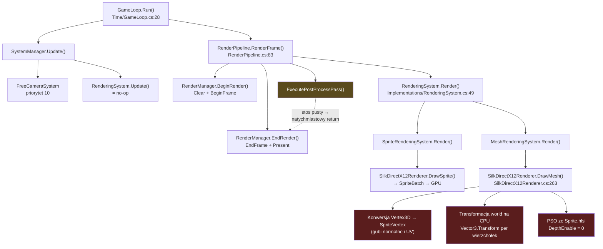

# HEngine — Dogłębna analiza stanu silnika

**Data analizy:** 2026-08-14
**Gałąź:** `master` @ `2cb0c54`
**Zakres:** architektura, faktyczna funkcjonalność runtime, dług techniczny
**Metoda:** analiza statyczna całego drzewa źródeł + build + pełny przebieg testów + empiryczna weryfikacja kontenera DI

---

## 1. Streszczenie wykonawcze

HEngine to silnik gier w C# (.NET 10) z własnym ECS i backendem DirectX 12 przez Silk.NET. Projekt buduje się bez błędów, a **wszystkie 602 testy przechodzą** (333 Core + 269 Rendering).

Kluczowe ustalenie tej analizy brzmi jednak inaczej niż sugerują istniejące dokumenty:

> **Silnik składa się z dwóch rozłącznych światów: wąskiej, działającej ścieżki renderowania oraz dużej, dobrze przetestowanej biblioteki podsystemów, która nie jest podłączona do niczego, co wykonuje się w czasie działania programu.**

Faktyczna ścieżka renderowania rysuje geometrię 3D **shaderem sprite'ów**, bez oświetlenia, bez bufora głębi i bez materiałów. Równolegle w repozytorium istnieje kompletny shader PBR z cieniami CSM, stos post-processingu, system materiałów, tekstur i cieni — żaden z tych elementów nie jest osiągalny z `GameLoop`.

To nie jest "częściowo ukończona integracja". To **brak integracji**: zweryfikowałem empirycznie, że kontener DI nie rejestruje ani jednego z tych podsystemów, a `RenderPipeline` konstruuje się przez konstruktor zapasowy, który jawnie wyłącza cienie i tworzy pusty stos post-processingu.

**Ocena syntetyczna:**

| Obszar | Stan | Komentarz |
|---|---|---|
| ECS Core | 🟡 Działa, ale nie jest data-oriented | Poprawny funkcjonalnie, kosztowny w hot-path, kilka realnych błędów |
| Pętla gry / DI | 🟡 Działa | Dwa rozłączne rejestry systemów, konstruktory zapasowe maskują braki |
| Renderowanie 2D (sprite) | 🟢 Działa end-to-end | Jedyna kompletna ścieżka GPU |
| Renderowanie 3D (mesh) | 🔴 Atrapa | Shader sprite'ów, brak głębi, brak światła, geometria regenerowana per klatkę |
| PBR | 🔴 Odłączone | Shader i struktury GPU gotowe, zero wywołań z runtime |
| Cienie (CSM) | 🔴 Odłączone | Logika i matematyka gotowe, brak implementacji `IShadowRenderer` |
| Post-processing | 🔴 Odłączone | Efekty liczą parametry, brak backendu GPU |
| Materiały / Tekstury | 🔴 Odłączone | Rozbudowane i przetestowane, zero referencji z runtime |
| Fizyka | 🔴 Tylko komponenty | Brak jakiegokolwiek systemu |
| Testy | 🟢 602/602 | Wysokie pokrycie — ale głównie kodu nieaktywnego |

---

## 2. Metryki projektu

| Metryka | Wartość |
|---|---|
| Projekty w solucji | 5 (Core, Rendering, App, 2× Tests) + Benchmarks |
| Kod produkcyjny | 172 pliki `.cs`, ~15 100 linii |
| — `HEngine.Core` | 77 plików, 4 223 linii |
| — `HEngine.Rendering` | 92 pliki, 10 312 linii |
| — `HEngine` (app) | 3 pliki, 551 linii |
| Kod testów | 65 plików, ~8 900 linii |
| Benchmarki | 3 pliki, 652 linie |
| Shadery HLSL | 7 plików |
| Testy | 602 (333 + 269), **100% zielonych** |
| Ostrzeżenia buildu | 11 (4 realne w kodzie, 7 NuGet/analizatory) |
| Historia | 26 commitów, 2025-07-17 → 2026-04-20 |

Stosunek kodu testów do kodu produkcyjnego wynosi ~0,59 — wysoki. Problemem nie jest ilość testów, lecz ich rozkład (patrz §9).

---

## 3. Architektura warstw

Podział warstwowy jest poprawny i konsekwentnie egzekwowany — to najmocniejsza strona projektu.

```
┌───────────────────────────────────────────────────┐
│ HEngine (composition root)                        │
│ Program.cs · EngineBuilder · GameEngine           │
├───────────────────────────────────────────────────┤
│ HEngine.Rendering (Windows / DX12)                │
│ Silk.NET · DirectX12* · Shadery · Materiały       │
├───────────────────────────────────────────────────┤
│ HEngine.Core (platform-agnostic)                  │
│ ECS · Transform · Query · Math · Kontrakty        │
└───────────────────────────────────────────────────┘
```

`HEngine.Core` faktycznie nie zawiera żadnej referencji do Silk.NET ani DirectX — cała komunikacja idzie przez 19 interfejsów w `Src/Core/HEngine.Core/Rendering/Contracts/`. Dzięki temu Core jest w pełni testowalny bez GPU i to się realnie opłaciło (333 testy Core bez urządzenia graficznego).

**Ale:** liczba kontraktów wyprzedza liczbę implementacji. `IShadowRenderer`, `IPostProcessCommandContext`, `IRenderManagerInterface`, `ITextureManager` istnieją jako abstrakcje, dla których jedyne implementacje to atrapy testowe albo klasy `Null*`. Abstrakcja została zaprojektowana przed backendem i backend nigdy nie powstał.

---

## 4. Faktyczna ścieżka wykonania

To jest sedno analizy. Poniżej to, co **realnie** dzieje się w każdej klatce:



### 4.1 Dowód: co jest zarejestrowane w DI

**Status: naprawione w #7 / PR #23.** Poniższy opis to stan sprzed tej zmiany, zachowany jako kontekst historyczny.

Zweryfikowałem to empirycznie, budując kontener dokładnie tak jak robi to `EngineBuilder`, i odpytując go o poszczególne usługi:

```
ShadowSettings registered      : False
PostProcessStack registered    : False
LightingSystem registered      : False
ShadowRenderingSystem reg.     : False
PbrSettings registered         : False
IRenderPipeline resolved       : True
PostProcessStack effect count  : 0
PostProcess enabled count      : 0
Pipeline ShadowSettings.Enabled: False
RenderPipeline ctor count      : 3
```

`RenderPipeline` miał trzy konstruktory. Ponieważ `LightingSystem`, `ShadowRenderingSystem`, `ShadowSettings` i `PostProcessStack` nie były zarejestrowane, `Microsoft.Extensions.DependencyInjection` wybierał **konstruktor 4-argumentowy**, który:

```csharp
_shadowSettings = new ShadowSettings { Enabled = false };   // wymuszone wyłączenie
_postProcessStack = new PostProcessStack();                  // zawsze pusty
```

W efekcie `ExecuteShadowPass` nigdy się nie wykonywał (`_shadowSettings.Enabled == false`), a `ExecutePostProcessPass` kończył się na pierwszej linii (`EnabledEffectCount == 0`).

To był **cichy downgrade**. Konstruktory zapasowe zamieniały brakującą konfigurację DI w milczące wyłączenie funkcji zamiast w błąd startu.

**Po #7:** `AddHEngineRendering` rejestruje `LightingSystem`, `ShadowRenderingSystem`, `PostProcessStack` oraz `ShadowSettings`/`PbrSettings`/`PostProcessingSettings` wprost z parametru `config`. `RenderPipeline` ma teraz jeden, w pełni jawny konstruktor — brakująca zależność jest błędem kompozycji, nie cichym fallbackiem. `Tests/HEngine.Rendering.Tests/CompositionTests.cs` waliduje cały graf usług (`ServiceProviderOptions.ValidateOnBuild`) jako regression guard.

**To nie zamyka historii cieni/post-processingu.** `ShadowSettings.Enabled` jest teraz honorowane zgodnie z configiem (domyślnie `true`), ale `ShadowRenderingSystem.SetShadowRenderer` nadal nie jest wołane nigdzie w kodzie produkcyjnym — jedyna implementacja `IShadowRenderer` to `FakeShadowRenderer` w testach (patrz 4.4). `RenderPipeline` sprawdza teraz `ShadowRenderingSystem.HasShadowRenderer` przed wejściem w `ExecuteShadowPass`, żeby nie płacić za gathering świateł i liczenie splitów kaskad bez żadnego efektu — ale wynik end-to-end jest ten sam: cienie się nie renderują, dopóki #19 nie dostarczy prawdziwego `IShadowRenderer` i nie podłączy go w kompozycji. Analogicznie post-processing: `PostProcessStack` jest teraz współdzielonym singletonem, ale nic w kodzie produkcyjnym nie woła `AddEffect`, więc `EnabledEffectCount == 0` nadal trzyma `ExecutePostProcessPass` na pierwszej linii — to zakres #20.

### 4.2 Dowód: geometria 3D idzie przez shader sprite'ów

`SilkDirectX12Renderer` używa `DirectX12ShaderManager`, w którym nazwa pliku shadera jest zahardkodowana:

```csharp
private readonly string _shaderFileName = "Sprite.hlsl";
```
— [DirectX12ShaderManager.cs:16](../Src/Rendering/HEngine.Rendering/Managers/DirectX12ShaderManager.cs#L16)

Te same bloby VS/PS trafiają do `DirectX12PipelineStateManager`, który tworzy PSO dla mesh'y. Layout wejściowy tego PSO to wyłącznie `POSITION` (float3) + `COLOR` (float4) — [DirectX12PipelineStateManager.cs:117-139](../Src/Rendering/HEngine.Rendering/Managers/DirectX12PipelineStateManager.cs#L117). Brak `NORMAL`, brak `TEXCOORD`.

`Mesh.hlsl` — jedyny shader z modelem oświetlenia Lambert — **nie jest kompilowany nigdzie w kodzie**. `PBR.hlsl` również nie.

**Konsekwencja:** w demie tworzone są 1 światło kierunkowe i 3 światła punktowe ([GameEngine.cs:386-423](../HEngine/GameEngine.cs#L386)). Nie mają one **żadnego** wpływu na obraz. Piksel = interpolowany kolor wierzchołka, koniec.

### 4.3 Dowód: brak bufora głębi

W całym module renderowania jest dokładnie jedno wywołanie `OMSetRenderTargets`:

```csharp
commandList.OMSetRenderTargets(1, &rtvHandle, false, (CpuDescriptorHandle*)null);
```
— [DirectX12SwapChain.cs:110](../Src/Rendering/HEngine.Rendering/DirectX12/DirectX12SwapChain.cs#L110)

Ostatni argument (DSV) jest `null`. W repozytorium nie ma ani jednego `CreateDepthStencilView`. PSO dla mesh'y ma dodatkowo `DepthEnable = 0` i `CullMode.None`.

**Konsekwencja:** widoczność w scenie 3D zależy wyłącznie od kolejności rysowania (algorytm malarza), a kolejność wynika z kolejności iteracji po ECS. Piramida z 10 sześcianów, pierścień z 16 i ściany będą się przenikać w sposób zależny od kolejności tworzenia encji. Dodatkowo sprite'y rysowane są **przed** meshami ([RenderingSystem.cs:63-64](../Src/Rendering/HEngine.Rendering/Systems/Implementations/RenderingSystem.cs#L63)), więc geometria 3D zasłania odznaki 2D.

### 4.4 Dowód: nieaktywne podsystemy

Zliczenie referencji poza własnym plikiem definicji, z podziałem na kod produkcyjny i testy:

| Typ | Referencje w `Src/` + `HEngine/` | Referencje w `Tests/` |
|---|---:|---:|
| `DirectX12MeshRenderer` (renderer PBR) | **0** | 2 |
| `ShadowMapManager` | **0** | 1 |
| `ShadowPipelineStateManager` | **0** | 0 |
| `RenderTargetManager` | **0** | 0 |
| `MaterialManager` | **0** | 1 |
| `MaterialLibrary` | **0** | 1 |
| `MaterialInstanceManager` | **0** | 0 |
| `MaterialPropertyBuffer` | **0** | 0 |
| `SamplerManager` | **0** | 2 |
| `MeshAssetLoadingSystem` | **0** | 1 |
| `FrustumCullingSystem` | **0** | 1 |
| `SceneGraph` | **0** | 2 |

`DirectX12MeshRenderer` to klasa opisana w `PROJECT_OVERVIEW.md` jako *"the main component for drawing 3D geometry"*. Ma zero wywołań z kodu produkcyjnego. Jest w pełni napisana — obsługuje trzy zmapowane bufory stałych (Scene/Material/Light), indeksowane rysowanie, poprawną macierz normalnych — i całkowicie nieużywana.

Analogicznie:
- **`IShadowRenderer`** — jedyna implementacja to `FakeShadowRenderer` w `Tests/HEngine.Rendering.Tests/Systems/ShadowPassTests.cs:11`. Brak implementacji produkcyjnej.
- **`IPostProcessCommandContext`** — jedyne implementacje to `NullPostProcessCommandContext` (no-op, liczy wywołania) i `RecordingPostProcessContext` (test). `BloomEffect.Execute()` ustawia stałe i woła `DrawFullscreenTriangle()`, które jedynie inkrementuje licznik. **Nie istnieje żadna ścieżka, w której post-processing dotyka GPU.**

### 4.5 Dowód: martwe systemy ECS

`GameEngine.Initialize()` rejestruje w `SystemManager` dokładnie dwa systemy ([GameEngine.cs:169,171](../HEngine/GameEngine.cs#L169)):

```csharp
_systemManager.AddSystem(freeCameraSystem, 10);
_systemManager.AddSystem(_renderingSystem);
```

Nie są rejestrowane: `TransformHierarchySystem`, `FrustumCullingSystem`, `LightingSystem`, `ShadowRenderingSystem`, `MeshAssetLoadingSystem`.

Kaskada skutków:
- `FrustumCullingSystem` to **jedyny producent** komponentu `Culled` ([FrustumCullingSystem.cs:49](../Src/Core/HEngine.Core/Systems/FrustumCullingSystem.cs#L49)). Skoro nie działa, sprawdzenia `HasComponent<Culled>` w `MeshRenderingSystem` i `LightingSystem` zawsze zwracają `false` — culling jest martwy w obie strony. Encje demo i tak nie mają `BoundingBox`, więc nawet po rejestracji system nie miałby na czym pracować.
- `Renderable` jest używany w **jednym miejscu** w całym kodzie produkcyjnym: w zapytaniu shadow-castera `With<Transform, Mesh, Renderable>` ([ShadowRenderingSystem.cs:72](../Src/Rendering/HEngine.Rendering/Systems/ShadowRenderingSystem.cs#L72)). Demo nigdy nie dodaje `Renderable`. Gdyby więc włączyć cienie i dostarczyć `IShadowRenderer`, zbiór obiektów rzucających cień i tak byłby **pusty**.

---

## 5. Analiza warstwy Core (ECS)

### 5.1 Co jest dobre

- **Czystość warstwy** — zero zależności od API graficznego, w pełni testowalne.
- **Sparse set** w `ComponentStorage<T>` — `entityToIndex` / `indexToEntity` / gęsta tablica komponentów. Właściwa struktura danych.
- **Generacyjne uchwyty encji** — `Entity(Id, Generation)` to poprawny wzorzec przeciw wiszącym referencjom.
- **Zwracanie `ref T`** z `GetComponent` — pozwala modyfikować komponent w miejscu bez kopiowania.
- **Benchmarki** (BenchmarkDotNet) dla zapytań, storage'u i hierarchii transformów — dobry nawyk.

### 5.2 Problem: to nie jest architektura data-oriented

README deklaruje *"data-oriented ECS for cache-friendly, scalable game logic"* i *"zero-allocation rendering pipeline"*. Faktyczna implementacja realizuje coś przeciwnego.

**Trzy warstwy blokad na każdy dostęp do komponentu:**

```
ComponentManager        → lock (_lock)              [Lock, każda metoda publiczna]
ComponentStorage<T>     → ReaderWriterLockSlim      [każda operacja]
_componentStorages      → ConcurrentDictionary      [lookup po Type]
```

Sekwencja `MeshRenderingSystem` iterująca 47 mesh'y wykonuje na klatkę ~94 przejścia przez `GetComponent<T>` (Transform + Mesh), z czego każde bierze `Lock` i `ReaderWriterLockSlim` oraz robi lookup słownikowy po `typeof(T)`. Przy jednowątkowej pętli gry jest to czysty narzut.

**Deconstruct kopiuje komponenty.** `QueryItem<T1,T2>` udostępnia `ref` przez właściwości `Component1`/`Component2`, ale metoda `Deconstruct` — z której korzysta cały kod silnika (`foreach (var (entity, transform, mesh) in query)`) — zwraca **kopie przez wartość** ([QueryItem.cs:50-55](../Src/Core/HEngine.Core/Queries/QueryItem.cs#L50)). Zapisy do `transform` w takiej pętli są bezgłośnie tracone.

**Iteracja nie jest liniowa po pamięci.** `QueryEnumerator` przechowuje `List<Entity>` i dla każdej encji woła `GetComponent` z pełnym pościgiem wskaźników `entityToIndex → components`. Gęsta tablica komponentów istnieje, ale nikt po niej nie iteruje sekwencyjnie. Zaleta sparse setu jest zmarnowana.

**`Mesh` zawiera pole referencyjne.** `public string MaterialPath` wewnątrz `struct Mesh : IComponent` ([Mesh.cs](../Src/Rendering/HEngine.Rendering/Components/Mesh.cs)) czyni komponent nie-blittable. Wyklucza to operacje masowe przez `Unsafe`, SIMD i przyjazny dla Native AOT układ pamięci — czyli dokładnie te rzeczy, które deklaruje README.

### 5.3 Problem: alokacje w hot-path

Na każdą klatkę, dla każdego mesha, `MeshRenderingSystem.Render()`:

1. `MeshPrimitives.CreateCube()` — alokuje `Vertex3D[24]` + `uint[36]`
2. `Flatten()` — alokuje `float[288]`
3. `SilkDirectX12Renderer.DrawMesh` — alokuje `SpriteVertex[36]`, ewentualnie `Array.Resize`

Plus raz na klatkę na zapytanie: nowy obiekt `Query<T1,T2>`, nowa `List<Entity>`, domknięcie lambdy dla `RemoveAll`, oraz skan całej pojemności storage'u w `GetEntitiesWithComponent`.

Dla sceny demo (42 sześciany + 5 płaszczyzn) daje to **~148 KB śmieci na klatkę, czyli ~9 MB/s przy 60 FPS**. Geometria sześcianu jednostkowego jest generowana od nowa 42 razy w każdej klatce, mimo że jest stała.

**Pole `Mesh.IndexCount` jest całkowicie ignorowane** — geometria wynika wyłącznie z `switch` po `VertexArrayId`.

### 5.4 Błędy funkcjonalne

**(a) Zniszczona encja pozostaje ważna.**

```csharp
public void DestroyEntity(Entity entity) {
    if (_disposed || !IsEntityValid(entity)) return;
    _freeEntityIds.Enqueue(entity.Id);       // generacja NIE jest inkrementowana
}
```
— [EntityManager.cs:63](../Src/Core/HEngine.Core/Managers/EntityManager.cs#L63)

Generacja rośnie dopiero przy **ponownym użyciu** ID ([EntityManager.cs:51](../Src/Core/HEngine.Core/Managers/EntityManager.cs#L51)). Do tego czasu `IsEntityValid(entity)` nadal zwraca `true` dla zniszczonej encji — cały sens uchwytów generacyjnych zostaje zniesiony w oknie między zniszczeniem a recyklingiem.

**(b) Podwójne zniszczenie tworzy aliasy encji.**

Skoro po `DestroyEntity` encja pozostaje ważna, drugie wywołanie przechodzi walidację i wrzuca **to samo ID drugi raz** do kolejki wolnych. Dwa kolejne `CreateEntity()` zwrócą wtedy dwie encje o identycznym `Id` i różnych generacjach, wskazujące na te same sloty storage'u.

**(c) `Compact()` psuje mapowanie.**

```csharp
_components = newComponents;
_indexToEntity = newIndexToEntity;
_capacity = _count;          // _entityToIndex NIE jest przeliczane ani resize'owane
```
— [ComponentStorage.cs:239-241](../Src/Core/HEngine.Core/Storages/ComponentStorage.cs#L239)

Po `Compact()` pole `_capacity` spada do `_count`, ale tablica `_entityToIndex` zachowuje starą długość i stare wpisy dla usuniętych encji. Ponieważ `HasComponent` bramkuje się warunkiem `entity.Id >= _capacity`, każda żywa encja o `Id > _count` zaczyna raportować brak komponentu. `TrimExcess()` woła `Compact()` automatycznie, więc problem jest osiągalny bez jawnego wywołania.

**(d) `GetComponent` bez kontroli zakresu.**

`HasComponent` i `TryGetComponent` sprawdzają `entity.Id >= _capacity`, ale `GetComponent` idzie prosto do `HasComponentUnsafe`, które indeksuje `_entityToIndex[entity.Id]`. Dla encji o ID spoza zakresu daje to `IndexOutOfRangeException` zamiast czytelnego błędu domenowego.

**(e) `GetAllComponents()` zwraca kopię.**

```csharp
var result = new T[_count];
CopyActiveComponentsUnsafe(result);
return result.AsSpan();
```
— [ComponentStorage.cs:166-168](../Src/Core/HEngine.Core/Storages/ComponentStorage.cs#L166)

Sygnatura `Span<T>` sugeruje widok umożliwiający zapis. Zwracana jest świeża tablica — zapisy przez ten span nie trafiają do storage'u i giną bez śladu.

### 5.5 Błąd architektoniczny: dwa rozłączne rejestry systemów

`WorldManager` tworzy **własną, prywatną** instancję `SystemManager`:

```csharp
private readonly SystemManager _systemManager = new();
```
— [WorldManager.cs:10](../Src/Core/HEngine.Core/Managers/WorldManager.cs#L10)

Jednocześnie DI rejestruje `SystemManager` jako singleton, i to **jego** wstrzykuje do `GameEngine` oraz `GameLoop`. Istnieją zatem dwa niezależne rejestry:

| Rejestr | Kto dodaje | Kto wykonuje |
|---|---|---|
| Singleton z DI | `GameEngine.Initialize()` | `GameLoop.Run()` → `_systemManager.Update()` |
| Prywatny w `WorldManager` | `WorldManager.AddSystem()`, `SceneGraph` | `WorldManager.Update()` — **nigdy nie wołane** |

Każdy system zarejestrowany przez `WorldManager.AddSystem()` **nigdy się nie wykona**. Dotyczy to m.in. `SceneGraph`, który rejestruje `TransformHierarchySystem` przez `_world.AddSystem(_hierarchy)` ([SceneGraph.cs:25](../Src/Core/HEngine.Core/Scene/SceneGraph.cs#L25)). To pułapka, która nie zgłasza żadnego błędu — system po prostu milczy.

### 5.6 Wyciek pamięci w `WorldManager.CreateQuery`

```csharp
public Query<T1> CreateQuery<T1>() {
    var query = QueryBuilder.With<T1>();
    _queryCache.Add(query);     // nigdy nie usuwane
    return query;
}
```
— [WorldManager.cs:43](../Src/Core/HEngine.Core/Managers/WorldManager.cs#L43)

`FrustumCullingSystem.Update()` woła `CreateQuery` **dwa razy na klatkę** ([FrustumCullingSystem.cs:26,35](../Src/Core/HEngine.Core/Systems/FrustumCullingSystem.cs#L26)). Lista `_queryCache` rośnie bez ograniczeń, a `InvalidateQueries()` — wołane przy każdym `AddComponent` / `RemoveComponent` / `DestroyEntity` — iteruje po całej tej rosnącej liście. Złożoność degraduje się liniowo w czasie działania.

Obecnie nieszkodliwe wyłącznie dlatego, że `FrustumCullingSystem` nie jest zarejestrowany. Uaktywnienie go bez naprawy tego miejsca wprowadzi wyciek natychmiast.

### 5.7 Martwe pole `_isDirty` w `Query`

`Query<T...>` ma `_cachedEntities` i flagę `_isDirty` odświeżaną tylko przy konstrukcji i w `Clear()`. Nie istnieje mechanizm unieważniania sterowany zmianą zestawu komponentów. W praktyce nie powoduje to nieaktualnych wyników — bo `QueryBuilder.With<>()` tworzy **nowy obiekt `Query` przy każdym wywołaniu**, więc pamięć podręczna nigdy nie żyje dłużej niż jedną klatkę. Cache jest więc jednocześnie bezużyteczny (zawsze zimny) i niebezpieczny (każdy, kto zatrzyma `Query` w polu, dostanie zamrożony wynik na zawsze).

`EntityManager` jest wstrzykiwany do wszystkich trzech wariantów `Query`, przypisywany do pola i **nigdy nieużywany**.

---

## 6. Analiza warstwy Rendering

### 6.1 Co jest solidne

- **`DirectX12SpriteRenderer`** — kompletna, działająca ścieżka: batching, cache stanu PSO, metryki, hot-reload shadera. To jedyny podsystem GPU przechodzący całą drogę od ECS do ekranu.
- **`ShaderDiskCache` + `ShaderFileWatcher`** — cache skompilowanych bloków na dysku z inwalidacją po hashu źródła oraz hot-reload. Dobrze zrobione.
- **`ShadowUtils`** — obliczanie splitów PSSM, narożników frustum, macierzy light-VP i snapowanie do siatki tekseli. Matematyka jest poprawna i przetestowana.
- **`PBR.hlsl`** — pełny model Cook-Torrance (GGX, Smith, Fresnel-Schlick), obsługa świateł kierunkowych/punktowych/stożkowych, 5 map materiału, PCF na `Texture2DArray` dla kaskad. Kompletny i sensowny shader.
- **`TextureLoader`** — PNG/JPG/BMP/TGA przez StbImageSharp + własny parser DDS (DXT1/3/5). Solidne pokrycie testami.

### 6.2 Ścieżka mesh: szczegóły degradacji

`SilkDirectX12Renderer.DrawMesh()` ([SilkDirectX12Renderer.cs:263](../Src/Rendering/HEngine.Rendering/Systems/SilkDirectX12Renderer.cs#L263)) wykonuje ciąg operacji, z których każda gubi informację:

| Krok | Operacja | Utrata |
|---|---|---|
| 1 | `MeshRenderingSystem` generuje `Vertex3D` (pos, normal, uv, color) | — |
| 2 | `Flatten()` → `float[]` 12 pól na wierzchołek | typowanie |
| 3 | Rozwinięcie indeksów do listy trójkątów | **indeksowanie** — 24 wierzchołki → 36 |
| 4 | Odczyt tylko offsetów 0-2 i 8-11 | **normalne i UV** |
| 5 | `Vector3.Transform(pos, transform)` na CPU | transformacja na GPU |
| 6 | Zapis jako `SpriteVertex` (pos + color) | — |
| 7 | `DrawInstanced` (nieindeksowane) | wydajność |

Krok 3 zwiększa ruch wierzchołków o 50%, krok 4 czyni oświetlenie fizycznie niemożliwym, krok 5 przenosi na CPU pracę, do której służy vertex shader.

Dodatkowo `MeshRenderingSystem` obsługuje tylko `VertexArrayId` 1 (sześcian) i 2 (płaszczyzna); `default` również zwraca sześcian. Demo używa `VertexArrayId = 3` dla sfery i kul świateł ([GameEngine.cs:257,419](../HEngine/GameEngine.cs#L257)) — **renderują się one jako sześciany**. `MeshPrimitives.CreateSphere()` istnieje i jest przetestowany, ale nie ma ani jednego wywołania w kodzie produkcyjnym.

### 6.3 Konfiguracja w dużej mierze nieużywana

`EngineConfiguration` deklaruje sześć sekcji. Faktycznie odczytywane są dwie:

| Sekcja | Odczyt w kodzie produkcyjnym |
|---|---|
| `Window` | ✅ `GameEngine` (rozmiar, tytuł, aspect) |
| `Rendering` | ✅ `RenderManager` (clear color, projekcja, near/far) |
| `PBR` | ❌ zero odczytów |
| `Shadow` | ❌ zero odczytów |
| `PostProcessing` | ❌ zero odczytów |
| `Performance` | ❌ zero odczytów |

`PerformanceSettings.TargetFps` i `LimitFrameRate` nie są respektowane — `GameLoop` kręci się bez ograniczenia klatek i bez `VSync` sterowanego konfiguracją.

### 6.4 Duplikaty i martwy kod

- `Src/Rendering/HEngine.Rendering/DirectX12/DirectX12SpriteRenderer.cs` zawiera klasę o **innej nazwie niż plik** — `DirectX12Resources`. Klasa ta ma **zero referencji** w całym repozytorium (kod i testy). Czysty martwy kod pod mylącą nazwą pliku, kolidującą z realnym `Renderers/DirectX12SpriteRenderer.cs`.
- `MaterialTemplateSerializer.cs:190` — `throw new NotImplementedException()`.
- `RenderingSystem.SetRenderContext()` sprawdza `_disposed` i null, po czym **nic nie robi** ([RenderingSystem.cs:112](../Src/Rendering/HEngine.Rendering/Systems/Implementations/RenderingSystem.cs#L112)). `GameEngine.Initialize()` wywołuje tę metodę w przekonaniu, że przekazuje kontekst renderowania.
- `RenderingSystem` ma trzy konstruktory; ten z `ILogger` **ignoruje logger** (nie przypisuje go do żadnego pola).
- `Src/Core/Mathematics/` — katalog istnieje i jest pusty.
- `NetworkWriter` — wczesny zalążek, bez konsumentów.

### 6.5 Błąd: `Dispose()` na niezainicjalizowanym rendererze rzuca wyjątek

Wykryte podczas weryfikacji DI. `SilkDirectX12Renderer.Dispose()` bezwarunkowo woła `_meshBufferManager.Dispose()` ([SilkDirectX12Renderer.cs:353](../Src/Rendering/HEngine.Rendering/Systems/SilkDirectX12Renderer.cs#L353)), a pole to jest `null!` do czasu `Initialize()`. Zwolnienie kontenera DI, w którym renderer został utworzony, ale nigdy nie zainicjalizowany, kończy się `NullReferenceException` propagowanym przez `RenderManager.Dispose()` i `ServiceProvider.Dispose()`.

Ścieżka `IsInitialized`/`_disposed` jest sprawdzana w każdej innej metodzie tej klasy — tylko nie w `Dispose()`.

---

## 7. Rozjazd między dokumentacją a kodem

`docs/PROJECT_OVERVIEW.md` opisuje architekturę, która nie istnieje w wykonywanym kodzie:

> *"**DirectX12MeshRenderer:** The main component for drawing 3D geometry."*

Ma zero referencji produkcyjnych.

> *"The `GameEngine` initializes the rendering pipeline by setting up the `RenderManager`, which subsequently sets up the required DX12 resources via the `DirectX12MeshRenderer`."*

`RenderManager` nigdy nie dotyka `DirectX12MeshRenderer`. Inicjalizuje `SilkDirectX12Renderer`.

> *"HEngine implements a modern rendering structure optimized for PBR"* / *"The system utilizes three primary constant buffers per draw call"*

Te bufory istnieją w klasie, której nikt nie woła. Wykonywana ścieżka używa jednego CBV z macierzami View i Projection.

`docs/PHASE2_PLAN.md` oznacza fazy 2.1 (tekstury), 2.3 (cienie) i 2.4 (post-processing) jako **COMPLETE**. Każda z nich wyprodukowała przetestowany kod, którego nie da się osiągnąć z `GameLoop`. Definicje ukończenia (DoD) były najwyraźniej spełniane na poziomie „klasa istnieje i ma testy jednostkowe”, a nie „funkcja jest widoczna na ekranie”.

**To jest najważniejszy wniosek procesowy z tej analizy.** Zielone testy i zamknięte fazy planu wytworzyły przekonanie o postępie, które nie przekłada się na możliwości silnika. Warto dodać do DoD każdej kolejnej fazy twardy warunek: *funkcja jest zarejestrowana w DI i osiągalna z pętli gry*.

---

## 8. Ustalenia krytyczne — zestawienie

| # | Ustalenie | Skutek | Waga |
|---|---|---|---|
| 1 | Geometria 3D renderowana `Sprite.hlsl` | Brak oświetlenia jako takiego | 🔴 Krytyczna |
| 2 | Brak bufora głębi (DSV = null, `DepthEnable=0`) | Błędna widoczność, algorytm malarza | 🔴 Krytyczna |
| 3 | PBR / cienie / post-processing niezarejestrowane w DI | Trzy „ukończone” fazy nieaktywne | 🔴 Krytyczna |
| 4 | Konstruktory zapasowe cicho wyłączają funkcje | Braki konfiguracji nie dają błędu | 🔴 Krytyczna |
| 5 | Dwa rozłączne rejestry `SystemManager` | Systemy dodane przez `WorldManager` nie działają | 🔴 Krytyczna |
| 6 | Brak produkcyjnej implementacji `IShadowRenderer` | Cienie niemożliwe do włączenia | 🟠 Wysoka |
| 7 | Brak produkcyjnego `IPostProcessCommandContext` | Post-processing nie dotyka GPU | 🟠 Wysoka |
| 8 | `DestroyEntity` nie inkrementuje generacji | Zniszczona encja pozostaje ważna | 🟠 Wysoka |
| 9 | Podwójne `DestroyEntity` → aliasy ID | Dwie encje na tych samych slotach | 🟠 Wysoka |
| 10 | `Compact()` nie przelicza `_entityToIndex` | Utrata komponentów po `TrimExcess()` | 🟠 Wysoka |
| 11 | Regeneracja geometrii per klatkę | ~9 MB/s śmieci, sprzeczne z celem zero-alloc | 🟠 Wysoka |
| 12 | `Deconstruct` kopiuje komponenty | Ciche gubienie zapisów w pętlach | 🟠 Wysoka |
| 13 | `WorldManager._queryCache` rośnie bez granic | Wyciek po aktywacji cullingu | 🟡 Średnia |
| 14 | `Dispose()` rzuca NRE bez `Initialize()` | Awaria przy zamykaniu kontenera | 🟡 Średnia |
| 15 | `GetAllComponents()` zwraca kopię jako `Span<T>` | Zapisy przepadają | 🟡 Średnia |
| 16 | `VertexArrayId=3` renderuje się jako sześcian | Sfery w demie są sześcianami | 🟡 Średnia |
| 17 | 4 z 6 sekcji konfiguracji nieodczytywane | Konfiguracja pozorna | 🟡 Średnia |
| 18 | `SetRenderContext()` to pusta atrapa | Wywoływana z `GameEngine` jak realna | 🟡 Średnia |
| 19 | `DirectX12Resources` — martwy kod, mylący plik | Szum architektoniczny | 🟢 Niska |
| 20 | Blokady na każdy dostęp do komponentu | Narzut w jednowątkowej pętli | 🟢 Niska |

---

## 9. Testy — analiza rozkładu

602 zielone testy to realny atut, ale ich rozkład ujawnia ten sam problem co reszta analizy.

**Dobrze pokryte:** komponenty (~130 testów na proste struktury danych), `WorldManagerTests` (67), tekstury (65), matematyka cieni i frustum, formaty PBR, arytmetyka post-processingu.

**Luki:**
- **Zero testów integracyjnych ścieżki renderowania.** Nie istnieje test, który przechodziłby `RenderPipeline → RenderingSystem → MeshRenderingSystem → IRenderer` i weryfikował, że mesh trafia do renderera z poprawnymi danymi.
- **Zero testów rejestracji DI.** Gdyby istniał test sprawdzający, że `IRenderPipeline` dostaje `ShadowSettings` z konfiguracji, ustalenia #3 i #4 zostałyby wykryte w momencie ich powstania.
- **Testy weryfikują komponenty w izolacji, nie ich współpracę.** `ShadowPassTests` sprawdza `ShadowRenderingSystem` z atrapą `IShadowRenderer` — i przechodzi, mimo że implementacja produkcyjna nie istnieje. Test jest poprawny; myląca jest interpretacja jego zieloności jako „cienie działają”.
- `SmokeTests` istnieje, ale nie obejmuje faktycznego bootstrapu silnika.

**Ostrzeżenia buildu do naprawy:** `CS0168` (nieużywane `ex` w `DirectX12Device.cs:69`), `CS8767`/`CS8633` (nullability w `RenderPipelineTests.cs`), `xUnit2012`, `xUnit2031`, oraz `NU1603` (niedopasowanie wersji `StbImageSharp` 2.30.13 → 2.30.15).

---

## 10. Rekomendowana kolejność prac

Kolejność wynika z zależności technicznych — każdy krok odblokowuje następny.

### Etap 0 — Widoczność problemu (fundament)

1. ✅ **Usunąć konstruktory zapasowe** z `RenderPipeline` i `RenderingSystem`. Zostawić jeden, w pełni jawny. Brak zależności ma powodować błąd startu, a nie ciche wyłączenie funkcji. — #7 / PR #23.
2. ✅ **Zarejestrować w DI**: `LightingSystem`, `ShadowRenderingSystem`, `PostProcessStack`, oraz `config.Shadow` / `config.PBR` / `config.PostProcessing` jako osobne usługi. — #7 / PR #23.
3. ✅ **Dodać test rejestracji DI**, który weryfikuje, że kontener dostarcza komplet zależności potoku. To zabezpieczenie przed regresją całej tej klasy błędów. — #7 / PR #23.
4. **Ujednolicić `SystemManager`** — `WorldManager` powinien przyjmować go przez konstruktor, a nie tworzyć własny.

### Etap 1 — Naprawa ścieżki 3D (największy zwrot)

5. **Utworzyć bufor głębi** (DSV + `DXGI_FORMAT_D32_FLOAT`), związać go w `OMSetRenderTargets`, włączyć `DepthEnable` i `CullMode.Back` w PSO mesh'y.
6. **Rozdzielić menedżery shaderów.** `DirectX12ShaderManager` ma zahardkodowany `Sprite.hlsl`; ścieżka mesh musi ładować `Mesh.hlsl` lub `PBR.hlsl` z pełnym layoutem `POSITION/NORMAL/TEXCOORD/COLOR`.
7. **Podłączyć `DirectX12MeshRenderer`** zamiast konwersji do `SpriteVertex`. Klasa jest gotowa, ma indeksowane rysowanie i trzy bufory stałych. To głównie praca integracyjna, nie implementacyjna.
8. **Przekazać światła do renderera.** `LightingSystem.LastLights` → parametr `lights` w `DrawMesh`, który już istnieje w sygnaturze i już jest obsłużony po stronie GPU.

Po tym etapie demo po raz pierwszy pokaże oświetloną, poprawnie przesłanianą scenę 3D — i uaktywni się cała praca włożona w PBR.

### Etap 2 — Cache geometrii

9. **Wprowadzić rejestr mesh'y** (`VertexArrayId` → bufory GPU utworzone raz). Eliminuje regenerację geometrii per klatkę, ~9 MB/s alokacji oraz naprawia problem sfery renderowanej jako sześcian.
10. Podłączyć `MeshAssetLoadingSystem` i `AssetManager` do tego rejestru — to naturalny moment na domknięcie potoku assetów.

### Etap 3 — Poprawki ECS

11. Naprawić `DestroyEntity` (inkrementacja generacji przy zniszczeniu, ochrona przed podwójnym zwolnieniem).
12. Naprawić `Compact()` (przeliczenie `_entityToIndex`) i kontrolę zakresu w `GetComponent`.
13. Zmienić `Deconstruct` na warianty `ref` lub jasno udokumentować semantykę kopiowania.
14. Naprawić wyciek `_queryCache` **przed** aktywacją `FrustumCullingSystem`.

### Etap 4 — Domknięcie odłączonych funkcji

15. Zaimplementować produkcyjny `IShadowRenderer` (`ShadowMapManager` i `ShadowPipelineStateManager` już istnieją). Dodać `Renderable` do encji demo — bez tego zbiór shadow-casterów pozostanie pusty.
16. Zaimplementować produkcyjny `IPostProcessCommandContext` oparty na `PingPongRenderTargets` i `RenderTargetManager`.
17. Podłączyć `MaterialManager` do ścieżki rysowania — parametr `material` w `DrawMesh` już czeka.

### Etap 5 — Higiena

18. Usunąć `DirectX12Resources` i pusty katalog `Src/Core/Mathematics`.
19. Naprawić `Dispose()` w `SilkDirectX12Renderer`.
20. Wyzerować ostrzeżenia buildu, wyrównać wersję `StbImageSharp`.
21. **Zaktualizować `PROJECT_OVERVIEW.md`** do stanu faktycznego.

---

## 11. Wniosek

Największym nieporozumieniem wokół tego projektu jest ocena jego postępu przez pryzmat liczby napisanych klas i zielonych testów. W tych kategoriach HEngine wygląda na zaawansowany silnik PBR z cieniami kaskadowymi i post-processingiem. W kategoriach tego, co faktycznie wykonuje się w klatce, jest to renderer sprite'ów, przez który przepychana jest geometria 3D bez głębi i bez światła.

Dobra wiadomość jest taka, że to **nie jest dług wymagający przepisania**. Trudne części — matematyka CSM, shader Cook-Torrance, `DirectX12MeshRenderer` z trzema buforami stałych, cache shaderów, loader tekstur — są napisane i przetestowane. Brakuje warstwy sklejającej: rejestracji w DI, bufora głębi, wyboru właściwego shadera i przekazania świateł. Etapy 0-1 z §10 to relatywnie niewielka ilość pracy o nieproporcjonalnie dużym efekcie — odblokowują jednocześnie trzy „ukończone” fazy planu.

Rekomendacja procesowa na przyszłość: **żadna faza nie powinna być zamykana jako COMPLETE, dopóki jej efekt nie jest osiągalny z `GameLoop` i widoczny w scenie demo.** Test jednostkowy z atrapą dowodzi poprawności klasy, nie istnienia funkcji.
