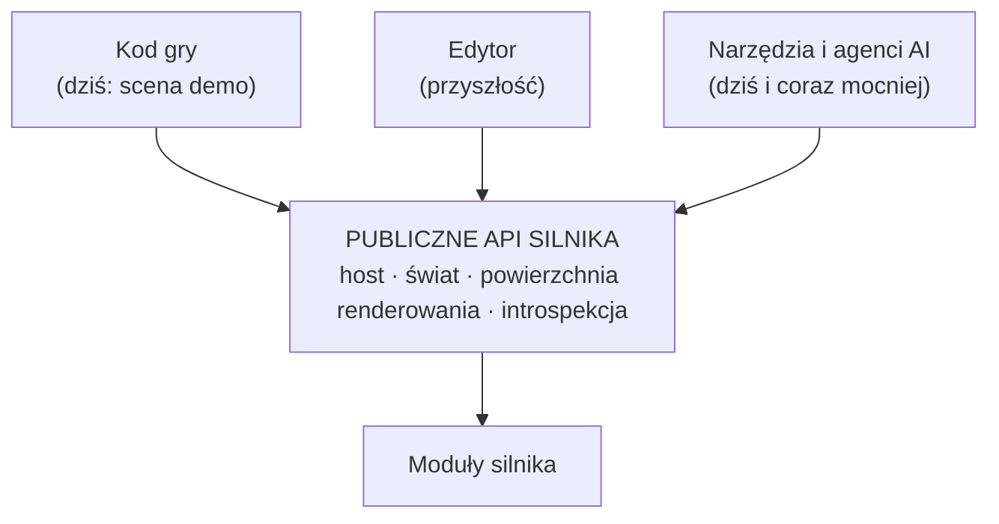
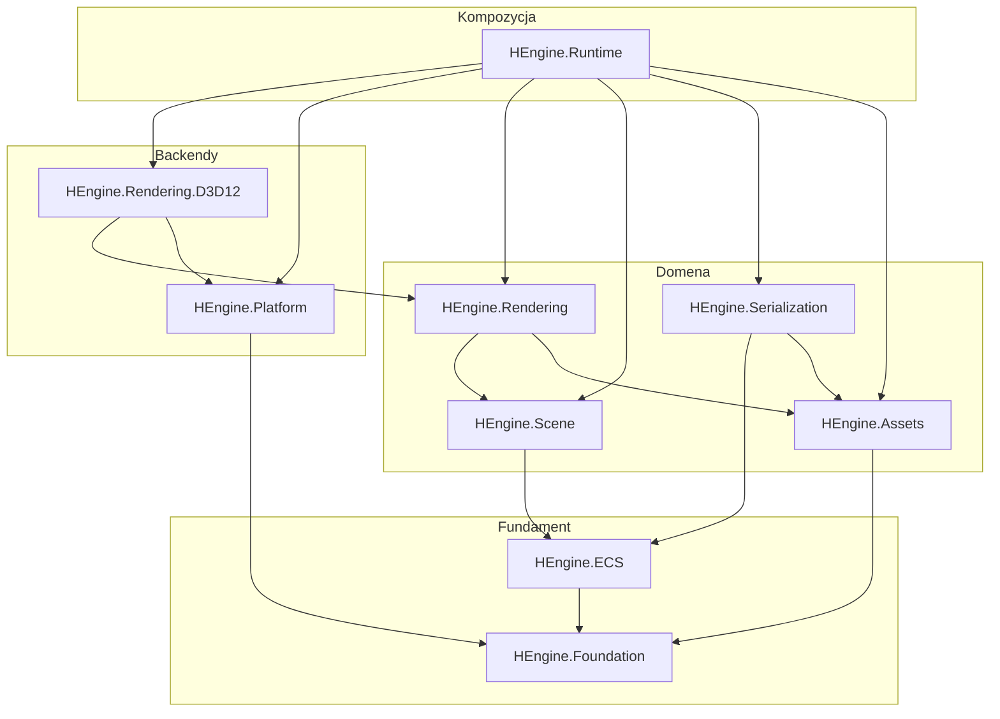
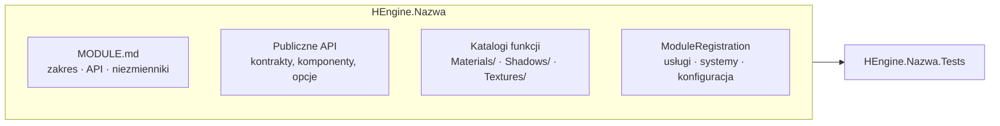
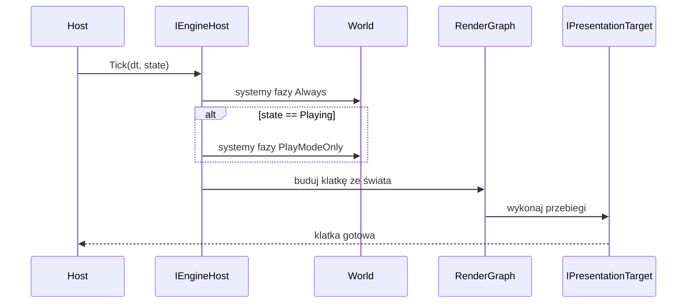
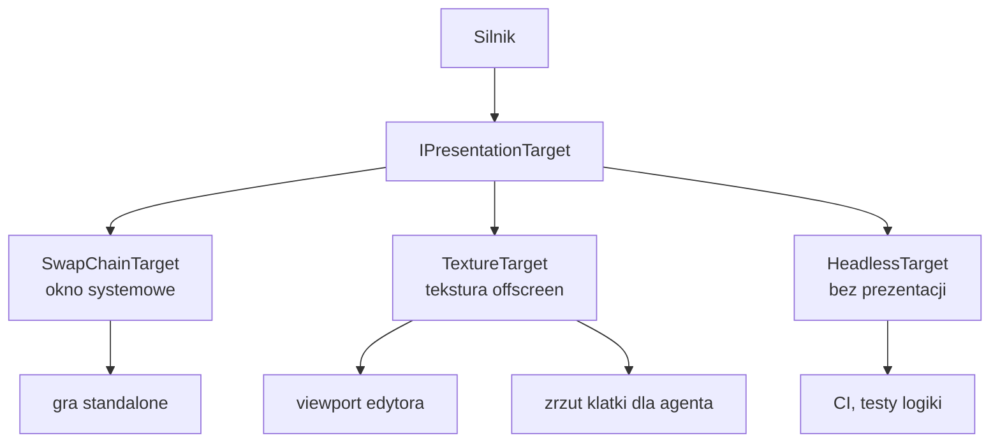
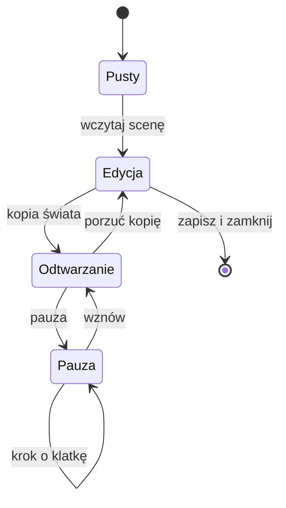
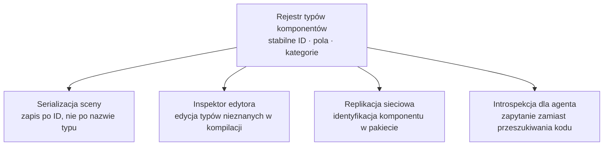
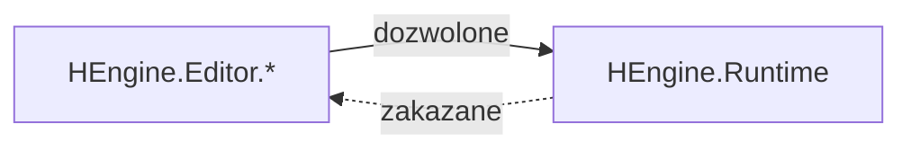
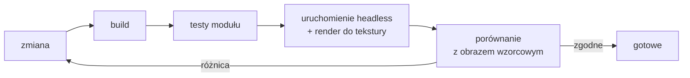

# HEngine — Architektura docelowa

**Data:** 2026-08-15
**Status:** propozycja do zatwierdzenia
**Dokument powiązany:** [ENGINE_STATE_ANALYSIS.md](ENGINE_STATE_ANALYSIS.md) — analiza stanu wyjściowego

> **Zakres tego dokumentu:** opisuje **stan docelowy** — podział na moduły, granice, publiczne API i zasady, które nim rządzą.
> Nie zawiera mapy przeniesień plików, etapów prac ani harmonogramu. Te należą do osobnego dokumentu wykonawczego.
> Nie planuje też implementacji edytora — edytor jest przyszłością, a tu ustalamy jedynie, jakie właściwości musi mieć API silnika, żeby był później możliwy.

---

## 1. Teza

Silnik ma wystawiać **jedno mocne API**, z którego korzystają trzej niezależni konsumenci: kod gry, przyszły edytor oraz narzędzia i agenci AI uczestniczący w wytwarzaniu.

Kluczowe rozstrzygnięcie: **to nie są trzy różne API.** Wymagania tych trzech konsumentów pokrywają się niemal całkowicie — jawny cykl życia, brak globalnego stanu, brak własności okna i pętli, introspekcja, determinizm, głośne błędy zamiast cichej degradacji. Projektowanie pod jednego z nich automatycznie obsługuje pozostałych.

Dwie konsekwencje warte podkreślenia na wstępie:

- Obecny `GameLoop` i `GameEngine` to rusztowanie służące uruchomieniu i podejrzeniu wyniku — nie zaprojektowany podsystem. W architekturze docelowej rolę „uruchom i pokaż" pełni cienki host próbki, a silnik nie jest właścicielem pętli.
- Ta sama zdolność — renderowanie do tekstury zamiast do okna — obsługuje viewport edytora **oraz** automatyczną weryfikację zmian graficznych przez agenta. Jeden szew, trzy zastosowania.

---

## 2. Zasady

Siedem reguł, do których odwołują się wszystkie decyzje w dokumencie.

**Z1 — Zależności płyną wyłącznie w dół.**
Żaden moduł nie sięga do modułu wyższego: ani referencją projektu, ani refleksją, ani `Assembly.Load`. Egzekwowane testem architektonicznym w CI, nie ustaleniem w dokumencie.

**Z2 — Kod mieszka przy funkcji, nie przy typie technicznym.**
Katalog nazywa obszar domeny (`Materials/`, `Shadows/`, `Shaders/`), nie kategorię wzorca (`Managers/`, `Data/`, `Factories/`). Zrozumienie jednego obszaru wymaga otwarcia jednego katalogu.

**Z3 — Granica assembly wymaga uzasadnienia.**
Osobne assembly powstaje tylko gdy ma inny zestaw zależności lub platformę, wymusza kierunek zależności niemożliwy do wymuszenia inaczej, albo jest osobno wdrażalne. Poza tym wystarczy katalog i przestrzeń nazw.

**Z4 — Moduł jest właścicielem swojej konfiguracji, komponentów i rejestracji.**
Nie istnieje centralne miejsce, które musi znać wszystkie moduły. Dodanie modułu nie wymaga edycji modułu niższego.

**Z5 — Brak zależności jest błędem, nie trybem pracy.**
Żadnych konstruktorów zapasowych ani domyślnych atrap, które cicho wyłączają funkcje. Kompozycja albo powiedzie się w całości, albo zgłosi błąd przy starcie.

**Z6 — Silnik nie jest właścicielem zasobów zewnętrznych.**
Nie tworzy okna, nie zajmuje wątku, nie posiada pętli, nie czyta zegara systemowego w środku. O tym decyduje host.

**Z7 — Niezmiennik nieegzekwowany maszynowo nie istnieje.**
Reguła architektoniczna musi objawiać się jako błąd kompilacji lub czerwony test. Reguła żyjąca wyłącznie w dokumencie zostanie złamana — przez człowieka pod presją czasu i przez agenta zawsze.

---

## 3. Moduły docelowe

### 3.1 Graf zależności

### 3.2 Odpowiedzialności

| Moduł | Odpowiada za | Uzasadnienie granicy (Z3) |
|---|---|---|
| **HEngine.Foundation** | Matematyka, kolekcje, diagnostyka, atrybuty metadanych | Zero zależności; fundament dla wszystkiego |
| **HEngine.ECS** | Encje, storage, zapytania, świat, harmonogram systemów, **rejestr typów komponentów** | Konsumenci potrzebują ECS bez wciągania renderowania |
| **HEngine.Assets** | Baza assetów na GUID-ach, importery, zliczanie referencji | Wymienny potok importu; używany także przez narzędzia offline |
| **HEngine.Serialization** | Format sceny i prefabu, (de)serializacja komponentów | Format jest kontraktem trwałym — izolacja chroni przed przypadkową zmianą |
| **HEngine.Scene** | Transform, hierarchia, scene graph, culling, kamera | Semantyka sceny niezależna od backendu graficznego |
| **HEngine.Rendering** | Abstrakcje renderowania, graf klatki, materiały, światła, definicje post-processingu | **Warstwa bez API graficznego** — umożliwia drugi backend i tryb headless |
| **HEngine.Rendering.D3D12** | Urządzenie DX12, PSO, bufory, shadery, konkretne przebiegi | Windows-only, ciężkie zależności Silk.NET; wymienny |
| **HEngine.Platform** | Okno, wejście, zegar, system plików | Konsument podstawia własną implementację |
| **HEngine.Runtime** | Host, tick, rejestr modułów, kompozycja DI | Jedyne miejsce znające pełny graf |

### 3.3 Moduły przewidziane

Rezerwacja miejsca w grafie — bez implementacji:

| Moduł | Pozycja |
|---|---|
| `HEngine.Physics` | obok `Scene`; zależny od ECS + Foundation |
| `HEngine.Animation` | obok `Rendering`; zależny od Scene |
| `HEngine.Particles` | zależny od Rendering |
| `HEngine.Network` | zależny od ECS + Serialization |
| `HEngine.Editor.*` | **ponad** Runtime; nigdy w drugą stronę |

### 3.4 Anatomia modułu

Każdy moduł ma ten sam kształt wewnętrzny. Przewidywalność struktury jest wymogiem funkcjonalnym, nie estetycznym — pozwala trafić do właściwego pliku bez przeszukiwania repozytorium.

Reguły: publiczne jest to, co konsument ma prawa używać — reszta `internal`. Katalogi nazywają funkcje (Z2). Każdy moduł ma dokładnie jeden punkt rejestracji (Z4) i jeden odpowiadający projekt testów.

**Limit rozmiaru: ~40 plików lub ~4000 linii na moduł.** Przekroczenie jest sygnałem do podziału. Uzasadnienie w §6.1.

---

## 4. Publiczne API silnika

Sekcja definiuje, co znaczy „mocne API" w tym projekcie. Każda właściwość jest uzasadniona konkretnym konsumentem.

### 4.1 Dziesięć właściwości

| # | Właściwość | Konsument, który tego wymaga |
|---|---|---|
| 1 | Jawny cykl życia; brak singletonów i stanu globalnego | wszyscy trzej |
| 2 | Silnik nie posiada okna ani pętli (Z6) | edytor, agent |
| 3 | Introspekcja: rejestry typów komponentów, modułów, przebiegów | edytor, agent |
| 4 | Jeden przechwytywalny punkt mutacji stanu | edytor (undo/redo) |
| 5 | Determinizm: `Tick(dt)` z jawnym krokiem czasu | agent, testy |
| 6 | Headless jako pełnoprawny tryb, nie ścieżka awaryjna | agent, CI |
| 7 | Stabilne identyfikatory zamiast nazw typów i ścieżek | edytor, serializacja |
| 8 | Rozszerzalność przez rejestrację, bez modyfikacji silnika | gra, edytor |
| 9 | Błąd zamiast cichej degradacji (Z5) | wszyscy trzej |
| 10 | Jawna granica `public` / `internal` | wszyscy trzej |

### 4.2 Host i przebieg klatki

Silnik wystawia `Tick` — jedną klatkę na żądanie. Kto i jak często ją woła, jest decyzją hosta.

Host standalone realizuje pętlę `while`. Edytor woła `Tick` z UI. Agent woła `Tick` N razy i porównuje wynik z obrazem wzorcowym. Silnik nie zna różnicy.

Systemy deklarują **fazę wykonania** — `Always`, `PlayModeOnly`, `EditorOnly`. Bez tego rozróżnienia tryb edycji nie jest możliwy: transform i renderowanie muszą działać zawsze, fizyka i logika gry tylko podczas odtwarzania.

### 4.3 Powierzchnia prezentacji

Rozdzielenie urządzenia graficznego od okna. Silnik renderuje do *celu*, nie do *okna*.

Ta jedna abstrakcja obsługuje cztery scenariusze. Odpowiada jej podział dzisiejszego, zrośniętego kontraktu na trzy niezależne: urządzenie graficzne (adapter, kolejki), cel prezentacji (rozmiar, resize, present) oraz host okna i wejścia w module `Platform`.

### 4.4 Świat i jego cykl życia

`World` jest zwykłym obiektem o jawnym czasie życia, nie singletonem. Wiele światów może istnieć równocześnie.

Świat edycji jest trwały i zapisywany. Świat odtwarzania to kopia porzucana po zatrzymaniu. Bez tego rozdziału wejście w tryb odtwarzania niszczy scenę użytkownika. Konsekwencja projektowa: jeden harmonogram systemów na świat, przekazywany jawnie — nie wstrzykiwany jako singleton.

### 4.5 Rejestr typów komponentów

Pojedynczy mechanizm obsługujący cztery niezależne potrzeby. To najlepiej zwracająca się inwestycja w całej architekturze.

Dziś `IComponent` jest pustym znacznikiem, a dostęp do komponentów wyłącznie generyczny — nie da się zapytać, jakie komponenty ma encja ani jakie mają pola.

Docelowo rejestr dostarcza: listę zarejestrowanych typów, metadane pól, kategorię, oraz odczyt i zapis komponentu po identyfikatorze runtime. **Identyfikator musi być stabilny i jawny** — nie `Type.FullName`, bo nazwa typu zmienia się przy refaktoryzacji, a zapisane sceny muszą to przetrwać.

### 4.6 Zakazane w publicznym API

Wymienione wprost, bo każda pozycja występuje dziś w kodzie i każda jest weryfikowalna maszynowo:

- `Assembly.Load` i wiązanie po nazwach typów — niewidoczne dla kompilatora, wyklucza trimming i AOT
- ścieżki plikowe jako identyfikatory assetów — rozpadają się przy reorganizacji projektu
- statyczny stan mutowalny i singletony
- konstruktory zapasowe wypełniające brakujące zależności atrapami (Z5)
- `internal` udostępniane przez `InternalsVisibleTo` konsumentom — to sygnał brakującego API, nie rozwiązanie

---

## 5. Przygotowanie pod przyszły edytor

Edytora nie projektujemy ani nie implementujemy. Ustalamy wyłącznie dwie rzeczy: jego miejsce w grafie zależności oraz te właściwości API, których dodanie później byłoby nieproporcjonalnie kosztowne.

### 5.1 Kierunek zależności

Runtime nigdy nie referuje edytora i nie zawiera kodu warunkowego `if (isEditor)`. Jedyny wyjątek to atrybuty metadanych (`[Tooltip]`, `[Range]`, `[ComponentId]`) w `Foundation` — muszą być dostępne przy definicjach komponentów, ale nie niosą logiki UI.

### 5.2 Właściwości o wysokim koszcie odroczenia

Cztery pozycje z §4 mają tę cechę, że są tanie teraz i bardzo drogie później — każda przecina kod, który w międzyczasie urośnie:

| Właściwość | Dlaczego kosztowna później |
|---|---|
| Rozdzielenie urządzenia i okna (§4.3) | Przechodzi przez cały potok renderowania |
| Świat bez singletonu (§4.4) | Przechodzi przez każdy system |
| Rejestr typów komponentów (§4.5) | Przechodzi przez każdy komponent |
| Jeden punkt mutacji stanu (§4.1 poz. 4) | Wymaga audytu wszystkich ścieżek zapisu |

Ostatnia pozycja nie wymaga teraz budowania systemu komend — wystarczy dyscyplina: `World` jest jedyną drogą do zmiany stanu, bez obchodzenia go bezpośrednim dostępem do warstwy komponentów.

### 5.3 Świadomie nierozstrzygnięte

Framework UI edytora, model dokowania, skrypting i hot-reload kodu gry, format pliku projektu. Żadna z tych decyzji nie jest przesądzana przez architekturę silnika — i to jest zamierzone. Decyzja o UI jest odwracalna, decyzje z §5.2 nie są.

---

## 6. Architektura pod pracę z AI i agentami

Sekcja traktowana **równorzędnie** z przygotowaniem pod edytor. Wychodzimy z założenia, że istotna część dalszego rozwoju tego silnika będzie prowadzona z udziałem agentów, a ich udział będzie rósł. Architektura musi to uwzględniać tak samo, jak uwzględnia wymagania przyszłego edytora.

Wyjściowa obserwacja: agent i człowiek zawodzą na tych samych rzeczach, ale agent zawodzi **konsekwentnie i bez wahania**. Człowiek, który nie rozumie kodu, zwolni i zapyta. Agent wygeneruje wiarygodnie wyglądającą zmianę. Architektura odporna na agentów to architektura, w której błędne założenie jest wykrywalne maszynowo.

Analiza stanu dostarcza modelowego przykładu: `RenderPipeline` z konstruktorem zapasowym, który cicho wyłącza cienie i post-processing. Zmiana w tym obszarze przechodzi kompilację, przechodzi 602 testy i nie działa. To najgorszy możliwy tryb pracy dla agenta — i dokładnie dlatego Z5 i Z7 są w tym dokumencie regułami, a nie zaleceniami.

### 6.1 Moduł jako jednostka kontekstu

Okno kontekstu jest skończone i pozostanie skończone, mimo że rośnie. Jeśli zrozumienie systemu materiałów wymaga otwarcia plików z pięciu katalogów, agent zużywa kontekst na nawigację zamiast na rozumowanie — i częściej pomija istotny fragment.

Stąd trzy powiązane decyzje:

- **Kolokacja funkcji (Z2)** — jeden obszar domeny w jednym katalogu. To ta sama reguła, która służy człowiekowi, ale dla agenta jej naruszenie jest kosztowniejsze.
- **Limit rozmiaru modułu** (~40 plików / ~4000 linii) — moduł ma się mieścić w kontekście w całości.
- **`MODULE.md` o ustalonym schemacie** — zakres, publiczne API, niezmienniki, punkty rozszerzeń. Plik czytany jako pierwszy, zanim agent otworzy kod.

### 6.2 Niezmienniki egzekwowane maszynowo (Z7)

Agent nie przeczyta `CONTRIBUTING.md` przed każdą zmianą, ale **zawsze** zobaczy błąd kompilacji i czerwony test. Reguła architektoniczna musi więc mieć postać wykonywalną:

| Reguła | Postać egzekwowalna |
|---|---|
| Kierunek zależności (Z1) | Test architektoniczny w CI |
| Zakaz `Assembly.Load` i wiązania po nazwach | Analizator, severity = error |
| Brak konstruktorów zapasowych (Z5) | Test kompozycji DI weryfikujący komplet zależności |
| Limit rozmiaru modułu | Kontrola w CI, ostrzeżenie |
| Granica `public` / `internal` | Test powierzchni API |

Komunikat błędu jest częścią interfejsu dla agenta. „Moduł Scene nie może zależeć od Rendering — przenieś typ do Foundation albo odwróć zależność" jest instrukcją. „Assertion failed" nią nie jest.

### 6.3 Brak magii w czasie działania

Wszystko, co wiąże komponenty systemu, musi być widoczne dla kompilatora i dla wyszukiwania tekstowego. Wiązanie przez refleksję po stringu jest dla agenta niewidzialne — zmieni nazwę assembly i nie znajdzie miejsca, które ją cytuje.

Dotyczy to bezpośrednio dzisiejszego `Assembly.Load("HEngine.Rendering")` w `AssetManager` oraz zahardkodowanej nazwy pliku shadera. W architekturze docelowej wiązanie odbywa się przez jawną rejestrację w module (Z4), czyli konstrukt sprawdzany przy kompilacji.

### 6.4 Zamknięta pętla weryfikacji

Najważniejsza decyzja tej sekcji. Agent musi móc **sam sprawdzić**, czy jego zmiana zadziałała. Jeśli weryfikacja zmiany w renderowaniu wymaga człowieka patrzącego w okno, agent nie domyka pętli i pracuje na ślepo.

Wymaga to trzech rzeczy z §4, które już tam są z innych powodów: headless jako pełnoprawny tryb (poz. 6), `TextureTarget` (§4.3) i deterministyczny `Tick(dt)` (poz. 5).

**To jest ten sam szew, który obsługuje viewport edytora.** Zdolność zaprojektowana pod przyszły edytor okazuje się warunkiem samodzielnej pracy agenta nad grafiką — i odwrotnie. Dobra ilustracja tezy z §1.

### 6.5 Granice modułów jako granice konfliktów

Przewidywany kierunek rozwoju to praca kilku agentów równolegle nad różnymi obszarami. Wtedy granica modułu przestaje być wyłącznie pojęciem architektonicznym i staje się granicą konfliktów scalania.

Praktyczne konsekwencje: zadanie nie powinno wymagać edycji więcej niż jednego modułu, punkty rejestracji są rozproszone po modułach zamiast skupione w jednym pliku (Z4), a testy są przypisane do modułu — co daje wąską, szybką pętlę zwrotną zamiast pełnego przebiegu 602 testów po każdej zmianie.

Dzisiejszy `ServiceCollectionExtensions` z centralną listą rejestracji jest przeciwieństwem tego układu: każde dodanie funkcji dotyka tego samego pliku.

### 6.6 Introspekcja jako narzędzie

Rejestry z §4.5 mają zastosowanie, o którym łatwo zapomnieć: **agent może zapytać silnik zamiast czytać kod.** Lista zarejestrowanych komponentów, kolejność systemów w harmonogramie, lista przebiegów renderowania, zrzut stanu sceny — uzyskane z działającego procesu są wiarygodniejsze niż wnioskowane ze źródeł, bo odzwierciedlają rzeczywistą kompozycję, a nie zamiar.

Gdyby taka introspekcja istniała dziś, ustalenia #3 i #5 z analizy stanu — nieaktywne podsystemy i dwa rozłączne rejestry systemów — byłyby widoczne w jednym zapytaniu zamiast wymagać prześledzenia kontenera DI.

### 6.7 Ścieżka wzorcowa

Spójne wzorce są warunkiem przewidywalnego generowania kodu. Dla każdej powtarzalnej czynności — dodanie komponentu, systemu, przebiegu renderowania, importera assetów — istnieje jedna udokumentowana recepta i jeden istniejący przykład wskazany wprost w `MODULE.md`.

Kryterium jakości: dwie niezależne realizacje tego samego zadania powinny wyjść niemal identyczne. Rozjazd oznacza, że wzorzec jest niedopowiedziany.

### 6.8 Zapis uzasadnień

Krótkie ADR-y dla decyzji nieoczywistych. Powód jest specyficzny dla pracy z agentami: **agent, który nie zna uzasadnienia celowej decyzji, potraktuje ją jako usterkę i „naprawi".** Zapis *dlaczego* jest zabezpieczeniem przed cofaniem świadomych wyborów — dotyczy to zwłaszcza miejsc wyglądających na nadmiarowe, jak rozdzielenie urządzenia od okna czy stabilne identyfikatory zamiast nazw typów.

---

## 7. Zbieżność wymagań

Podsumowanie tezy z §1 — te same właściwości API obsługują wszystkich konsumentów:

| Właściwość | Gra | Edytor | Agent AI |
|---|:--:|:--:|:--:|
| Brak własności okna i pętli (Z6) | ○ | ● | ● |
| Headless jako pełny tryb | ○ | ○ | ● |
| Deterministyczny `Tick(dt)` | ● | ● | ● |
| Świat bez singletonu | ○ | ● | ● |
| Rejestr typów komponentów | ○ | ● | ● |
| Jeden punkt mutacji stanu | ○ | ● | ○ |
| Głośny błąd zamiast degradacji (Z5) | ● | ● | ● |
| Kolokacja funkcji (Z2) | ○ | ○ | ● |
| Niezmienniki maszynowe (Z7) | ● | ● | ● |
| Rejestracja rozproszona po modułach (Z4) | ● | ● | ● |

● wymagane · ○ korzystne

Żaden wiersz nie jest wymagany wyłącznie przez jednego konsumenta. To główny argument za tym, że nie budujemy architektury „pod edytor" ani „pod AI" — budujemy architekturę o jawnych granicach i weryfikowalnych niezmiennikach, która obsługuje wszystkie trzy przypadki.

---

## 8. Decyzje do zatwierdzenia

| # | Decyzja | Opcje | Rekomendacja |
|---|---|---|---|
| 1 | Liczba modułów runtime | 9 wg §3.2 · agresywniejsze scalenie do 7 (`Scene`→`ECS`, `Serialization`→`Assets`) | 9 — granice mają uzasadnienie w Z3 |
| 2 | Postać identyfikatora typu komponentu | jawny GUID w atrybucie · stabilny string | Do rozstrzygnięcia; rzutuje na ergonomię i format sceny |
| 3 | Format sceny | tekstowy mergowalny · binarny | Tekstowy — mergowalność w Git i czytelność dla agenta |
| 4 | Los `NetworkWriter` | rozwijać jako `HEngine.Network` · usunąć | Usunąć — wzorzec i tak wymaga przeprojektowania pod rejestr typów |
| 5 | Limit rozmiaru modułu | ~40 plików / ~4000 linii · inny próg · brak limitu | Przyjąć próg jako ostrzeżenie w CI, nie twardy błąd |

---

## 9. Podsumowanie

Obecna struktura nie jest bałaganem — to rozsądny podział dwuwarstwowy, który przestał wystarczać, gdy liczba podsystemów urosła do kilkunastu. Objawy są policzalne: dwadzieścia niepowiązanych klas w katalogu `Managers/`, dwie sprzeczne definicje tego samego komponentu, `Assembly.Load` przebijające granicę warstw.

Architektura docelowa opiera się na jednej tezie: **silnik wystawia jedno mocne API, a gra, przyszły edytor i agenci AI są jego równorzędnymi konsumentami.** Zbieżność ich wymagań (§7) jest na tyle duża, że nie ma potrzeby projektowania osobnych ścieżek — wystarczy konsekwentnie stosować siedem zasad z §2.

Dwie reguły niosą nieproporcjonalnie dużą część wartości. **Z5** — brak zależności jest błędem, nie trybem pracy — eliminuje klasę usterek, w której wszystko się kompiluje, testy są zielone, a funkcja nie działa. **Z7** — niezmiennik nieegzekwowany maszynowo nie istnieje — jest jedynym mechanizmem, który utrzyma pozostałe zasady w mocy, gdy część zmian będzie powstawać automatycznie.

Warto też odnotować, co z tego dokumentu **nie** wynika. Nie przesądzamy technologii UI edytora, modelu współbieżności systemów ani formatu plików projektu. Te decyzje są odwracalne. Odwracalne nie są: własność okna, własność pętli, czas życia świata i sposób identyfikacji typów komponentów — i wyłącznie te cztery muszą zostać rozstrzygnięte zawczasu.
