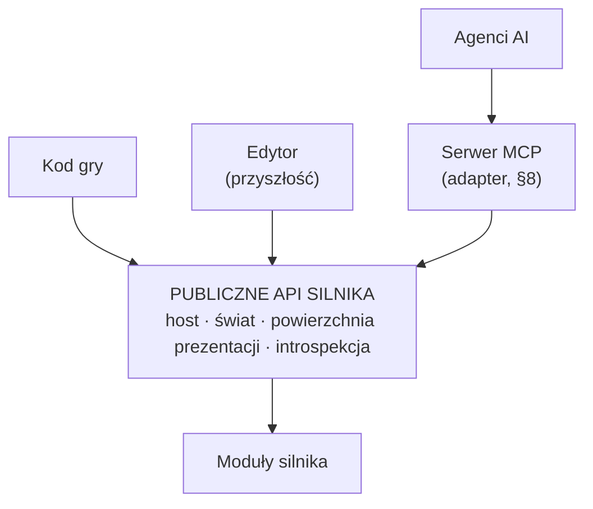
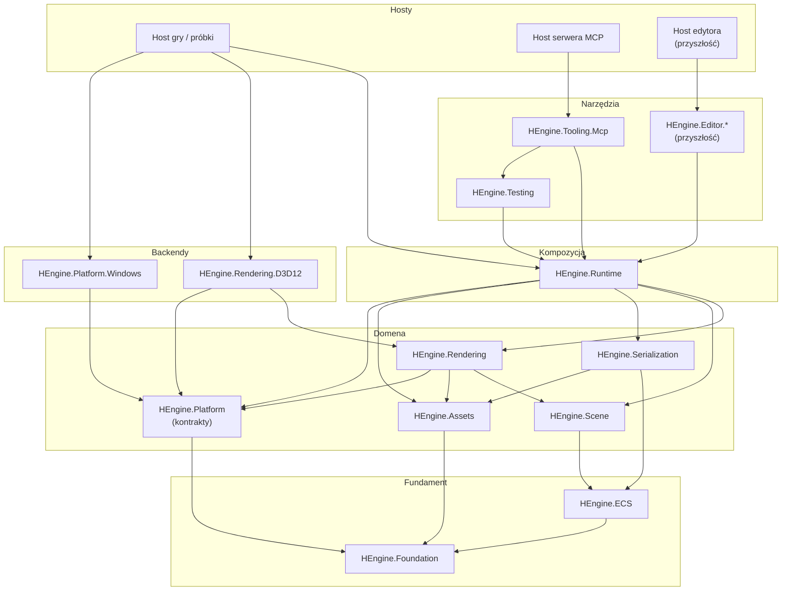
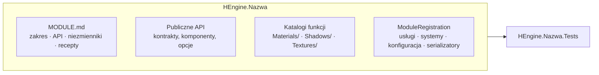
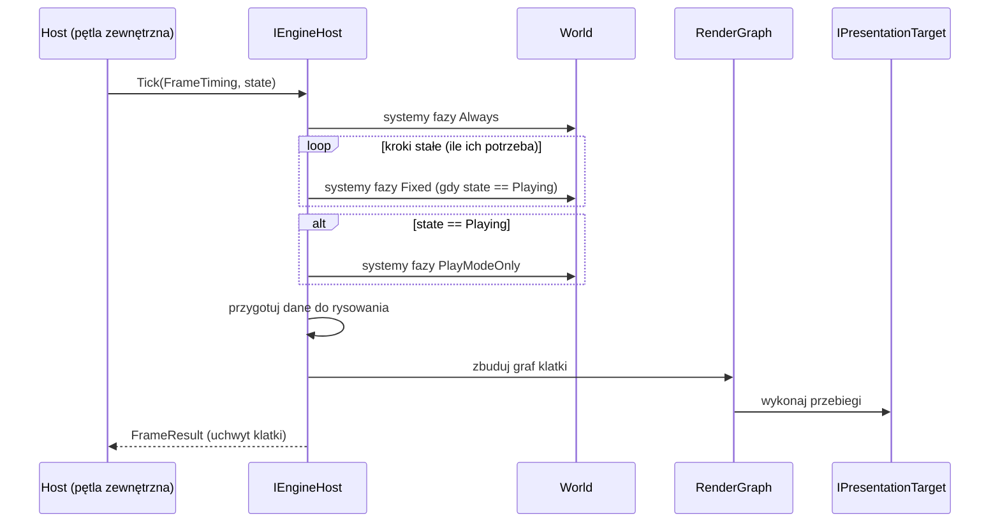
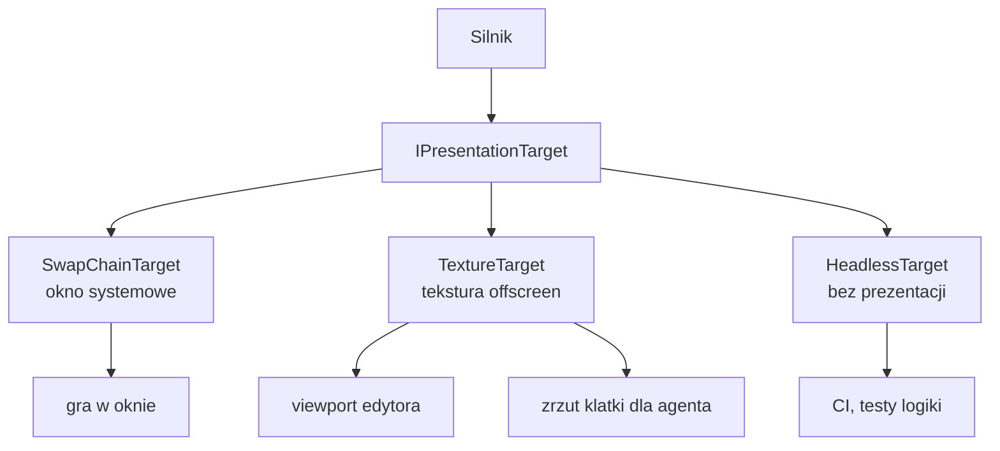
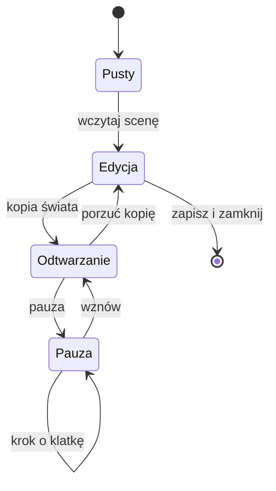
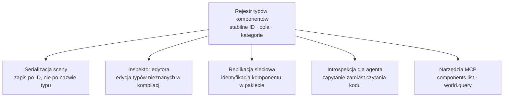
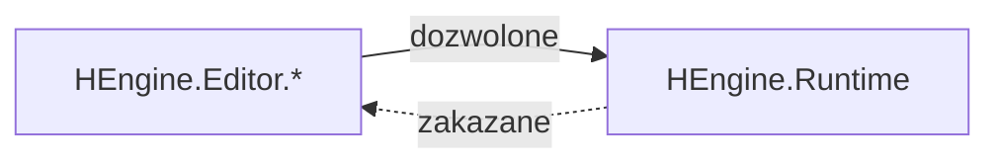
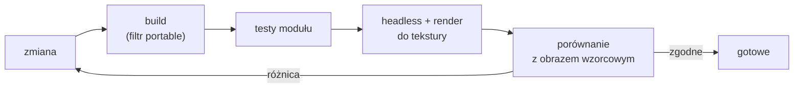
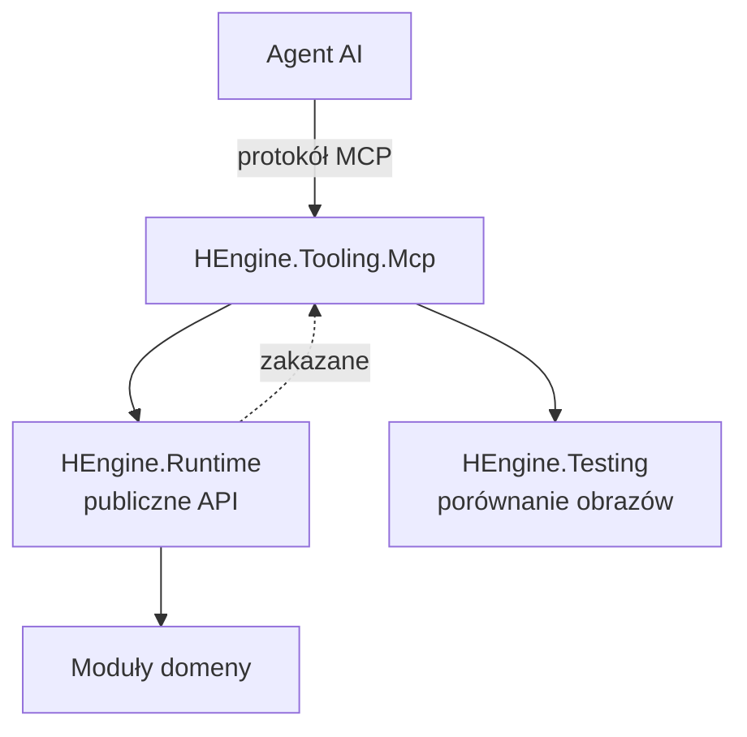

# HEngine — Architektura docelowa

**Data:** 2026-08-15
**Status:** propozycja do zatwierdzenia
**Dokument powiązany:** [ENGINE_STATE_ANALYSIS.md](ENGINE_STATE_ANALYSIS.md) — analiza stanu wyjściowego

> **Zakres tego dokumentu:** opisuje **stan docelowy** — podział na moduły, granice, publiczne API, organizację repozytorium i zasady, które nimi rządzą.
> Odniesienia do stanu obecnego są celowo skupione w §10, żeby reszta dokumentu opisywała cel, a nie punkt wyjścia. Faktografia bieżącego zachowania silnika należy do dokumentu analizy i nie jest tu powtarzana.
> Dokument nie zawiera mapy przeniesień plików, etapów prac ani harmonogramu — te należą do osobnego dokumentu wykonawczego.
> Nie planuje też implementacji edytora — edytor jest przyszłością, a tu ustalamy jedynie, jakie właściwości musi mieć API silnika, żeby był później możliwy.

**Spis treści**

0. [Słownik pojęć](#0-słownik-pojęć)
1. [Teza](#1-teza)
2. [Zasady](#2-zasady)
3. [Moduły docelowe](#3-moduły-docelowe)
4. [Publiczne API silnika](#4-publiczne-api-silnika)
5. [Organizacja repozytorium, projektów i solucji](#5-organizacja-repozytorium-projektów-i-solucji)
6. [Przygotowanie pod przyszły edytor](#6-przygotowanie-pod-przyszły-edytor)
7. [Architektura pod pracę z AI i agentami](#7-architektura-pod-pracę-z-ai-i-agentami)
8. [MCP — silnik jako serwer narzędzi](#8-mcp--silnik-jako-serwer-narzędzi)
9. [Zbieżność wymagań](#9-zbieżność-wymagań)
10. [Relacja do stanu obecnego](#10-relacja-do-stanu-obecnego)
11. [Decyzje do zatwierdzenia](#11-decyzje-do-zatwierdzenia)
12. [Podsumowanie](#12-podsumowanie)

---

## 0. Słownik pojęć

Dokument posługuje się kilkoma pojęciami w ustalonym, wąskim znaczeniu. Kilka z nich to terminy, dla których nie ma dobrego polskiego odpowiednika i tłumaczenie ich na siłę zaciemniałoby sens — te zostawiamy po angielsku i wyjaśniamy tutaj.

### Pojęcia własne tego dokumentu

| Pojęcie | Znaczenie |
|---|---|
| **host** | Program, który tworzy silnik, jest właścicielem okna i wątku i wywołuje kolejne klatki. Hostem jest gra, edytor, serwer narzędzi albo test — silnik sam hostem nie jest i nie zna różnicy między nimi. |
| **pętla zewnętrzna** | Ta część pętli gry, która należy do hosta: decyzja, kiedy zaczyna się kolejna klatka, oraz obsługa komunikatów okna. Nazwana osobno, bo tylko ona jest poza silnikiem (§4.2). |
| **przebieg klatki** | Wszystko, co dzieje się wewnątrz jednej klatki i w jakiej kolejności: fazy systemów, krok stały, przygotowanie danych do rysowania, wykonanie przebiegów renderowania. Należy do silnika. |
| **takt** | Pojedyncze wywołanie „wykonaj jedną klatkę" (`Tick`). Silnik nie wie, kto i jak często go woła. |
| **krok stały** | Symulacja liczona zawsze tym samym wycinkiem czasu, niezależnie od tego, ile trwała klatka. Wymaga licznika nadmiaru czasu, który przenosi resztę do następnej klatki. |
| **przygotowanie danych do rysowania** | Osobny krok, w którym stan świata zostaje przepisany do niezmiennego opisu tego, co ma zostać narysowane. Renderowanie czyta ten opis, a nie żywy świat. |
| **cel prezentacji** | Miejsce, w które trafia gotowa klatka: okno, tekstura albo nic (§4.3). |
| **moduł** | Jeden projekt, jedno assembly, jedna przestrzeń nazw główna, jeden projekt testów (§5.5). |
| **konsument** | Ktokolwiek korzysta z publicznego API silnika: kod gry, edytor, agent AI, test. |

### Terminy zostawione po angielsku

| Termin | Znaczenie |
|---|---|
| **headless** | Tryb pracy bez okna i bez wyświetlania obrazu. Silnik wykonuje pełną logikę klatki, obraz albo powstaje w teksturze, albo nie powstaje wcale. |
| **backend** | Wymienna warstwa wykonawcza pod wspólnym kontraktem — tu: konkretne API graficzne (Direct3D 12) albo konkretny system okien (Windows). |
| **swap chain** | Zestaw buforów obrazu, które karta graficzna wymienia z monitorem przy wyświetlaniu kolejnych klatek. |
| **fence** | Znacznik synchronizacji z kartą graficzną — pozwala procesorowi poczekać, aż karta skończy wcześniej zleconą pracę. |
| **singleton** | Obiekt istniejący w programie w jednym globalnym egzemplarzu, dostępny zewsząd bez przekazywania. W tym dokumencie zawsze jako coś, czego unikamy. |
| **culling** | Odrzucanie przed rysowaniem obiektów, których i tak nie widać. |
| **hot-reload** | Podmiana kodu lub zasobu w działającym programie, bez restartu. |
| **trimming** | Usuwanie nieużywanego kodu przy publikacji aplikacji, żeby zmniejszyć jej rozmiar. |
| **loopback** | Lokalny interfejs sieciowy — połączenie osiągalne wyłącznie z tej samej maszyny. |
| **draw call** | Pojedyncze zlecenie rysowania wysłane do karty graficznej. |
| **prefab** | Zapisany wzorzec obiektu sceny, z którego tworzy się egzemplarze. |

### Skróty

| Skrót | Rozwinięcie | Co oznacza |
|---|---|---|
| **AOT** | Ahead-Of-Time | Kompilacja do kodu maszynowego przed uruchomieniem, zamiast w trakcie |
| **ADR** | Architecture Decision Record | Krótka notatka: jaką decyzję podjęto i dlaczego |
| **API** | Application Programming Interface | Powierzchnia, przez którą konsument korzysta z silnika |
| **CI** | Continuous Integration | Automatyczny build i testy uruchamiane po każdej zmianie |
| **CPM** | Central Package Management | Mechanizm .NET: wersje pakietów zapisane raz dla całego repozytorium |
| **DI** | Dependency Injection | Wstrzykiwanie zależności — obiekt dostaje swoje zależności z zewnątrz, zamiast je tworzyć |
| **ECS** | Entity-Component-System | Model danych: encja jako identyfikator, komponent jako dane, system jako logika |
| **GUID** | Globally Unique Identifier | 128-bitowy identyfikator, w praktyce niepowtarzalny |
| **MCP** | Model Context Protocol | Protokół, przez który agent AI wywołuje narzędzia udostępnione przez program (§8) |
| **PSO** | Pipeline State Object | Obiekt Direct3D 12 opisujący komplet ustawień potoku graficznego |
| **TFM** | Target Framework Moniker | Oznaczenie platformy docelowej projektu, np. `net10.0` albo `net10.0-windows` |
| **UI** | User Interface | Interfejs użytkownika |
| **VSync** | Vertical Synchronization | Wstrzymanie prezentacji klatki do momentu odświeżenia monitora |

---

## 1. Teza

Silnik ma wystawiać **jedno mocne API**, z którego korzystają trzej niezależni konsumenci: kod gry, przyszły edytor oraz narzędzia i agenci AI uczestniczący w wytwarzaniu.



Kluczowe rozstrzygnięcie: **to nie są trzy różne API.** Wymagania tych trzech konsumentów pokrywają się niemal całkowicie — jawny cykl życia, brak globalnego stanu, brak własności okna i pętli zewnętrznej, introspekcja, determinizm, głośne błędy zamiast cichej degradacji. Projektowanie pod jednego z nich automatycznie obsługuje pozostałych.

Trzy konsekwencje warte podkreślenia na wstępie:

- **Agent nie dostaje własnej ścieżki do środka silnika.** Serwer MCP (Model Context Protocol — protokół, przez który agent AI wywołuje narzędzia udostępnione przez program) jest cienkim adapterem nad tym samym publicznym API — i właśnie dlatego jest przydatny jako test kompletności tego API (§8).
- **Ta sama zdolność — renderowanie do tekstury zamiast do okna — obsługuje viewport edytora oraz automatyczną weryfikację zmian graficznych przez agenta.** Jeden szew, trzy zastosowania.
- **„Silnik nie posiada pętli" to skrót myślowy, nie zasada.** Rozbicie tego zdania na trzy rozdzielne własności jest przedmiotem §4.2 i jest jedną z ważniejszych korekt w tej wersji dokumentu.

---

## 2. Zasady

Osiem reguł, do których odwołują się wszystkie decyzje w dokumencie.

**Z1 — Zależności płyną wyłącznie w dół.**
Żaden moduł nie sięga do modułu wyższego: ani referencją projektu, ani refleksją, ani `Assembly.Load`. Egzekwowane testem architektonicznym w CI (Continuous Integration — automatyczny build i testy po każdej zmianie), nie ustaleniem w dokumencie.

**Z2 — Kod mieszka przy funkcji, nie przy typie technicznym.**
Katalog nazywa obszar domeny (`Materials/`, `Shadows/`, `Shaders/`), nie kategorię wzorca (`Managers/`, `Data/`, `Factories/`). Zrozumienie jednego obszaru wymaga otwarcia jednego katalogu.

**Z3 — Granica assembly wymaga uzasadnienia.**
Osobne assembly powstaje tylko gdy ma inny zestaw zależności lub platformę, wymusza kierunek zależności niemożliwy do wymuszenia inaczej, albo jest osobno wdrażalne. Poza tym wystarczy katalog i przestrzeń nazw.

**Z4 — Moduł jest właścicielem swojej konfiguracji, komponentów i rejestracji.**
Nie istnieje centralne miejsce, które musi znać wszystkie moduły. Dodanie modułu nie wymaga edycji modułu niższego.

**Z5 — Brak zależności jest błędem, nie trybem pracy.**
Żadnych konstruktorów zapasowych ani domyślnych atrap, które cicho wyłączają funkcje. Kompozycja albo powiedzie się w całości, albo zgłosi błąd przy starcie.

**Z6 — Silnik nie jest właścicielem zasobów zewnętrznych.**
Nie tworzy okna, nie zajmuje wątku, nie prowadzi pętli zewnętrznej i nigdzie w środku nie sięga po czas na własną rękę. Okno, wątek i zegar wchodzą do silnika jawnie, przekazane przez hosta. Precyzyjny podział odpowiedzialności za klatkę — §4.2.

**Z7 — Niezmiennik nieegzekwowany maszynowo nie istnieje.**
Reguła architektoniczna musi objawiać się jako błąd kompilacji lub czerwony test. Reguła żyjąca wyłącznie w dokumencie zostanie złamana — przez człowieka pod presją czasu i przez agenta zawsze.

**Z8 — Kompozycja backendu należy do hosta, nie do silnika.**
Warstwa kompozycji (`Runtime`) nie referuje żadnego backendu platformowego. Wybór „D3D12 czy headless", „okno Windows czy brak okna" jest decyzją hosta i jest widoczny w jego pliku projektu. Bez tego tryb headless jest deklaracją, a nie zdolnością — pierwszy `#if WINDOWS` w warstwie kompozycji unieważnia całą resztę tego dokumentu.

---

## 3. Moduły docelowe

### 3.1 Graf zależności



Trzy własności tego grafu są nieprzypadkowe i warto je nazwać wprost:

- **`Runtime` nie referuje backendów** (Z8). Dzięki temu `Runtime`, cała domena i ich testy budują się i wykonują na dowolnym systemie, a warunek „headless jest pełnoprawnym trybem" jest egzekwowany przez sam graf referencji, a nie przez dyscyplinę.
- **`Platform` jest rozdzielone na kontrakty i backend.** `HEngine.Platform` to wyłącznie abstrakcje (okno, wejście, źródło czasu, system plików, nieprzezroczysty uchwyt powierzchni natywnej) — zero zależności zewnętrznych. `HEngine.Platform.Windows` to implementacja na Silk.NET. Backend graficzny zależy od kontraktów, nie od implementacji, więc D3D12 nie wciąga za sobą biblioteki okienkowej.
- **Narzędzia i edytor leżą na tym samym piętrze.** `Tooling.Mcp`, `Testing` i przyszły `Editor.*` są konsumentami `Runtime` i nikt z dołu ich nie widzi.

### 3.2 Odpowiedzialności

| Moduł | Odpowiada za | Uzasadnienie granicy (Z3) |
|---|---|---|
| **HEngine.Foundation** | Matematyka, kolekcje, diagnostyka, atrybuty metadanych | Zero zależności; fundament dla wszystkiego |
| **HEngine.ECS** | Encje, magazyny komponentów, zapytania, świat, harmonogram systemów, **rejestr typów komponentów** | Konsumenci potrzebują samego ECS-a, bez wciągania renderowania |
| **HEngine.Platform** | Kontrakty: okno, wejście, źródło czasu, system plików, uchwyt powierzchni | Kontrakt oddzielony od implementacji, żeby backend graficzny nie zależał od biblioteki okienkowej |
| **HEngine.Assets** | Baza assetów na GUID-ach, importery, zliczanie referencji | Wymienny potok importu; używany także przez narzędzia offline |
| **HEngine.Serialization** | Format sceny i prefabu, mechanizm (de)serializacji komponentów | Format jest kontraktem trwałym — izolacja chroni przed przypadkową zmianą |
| **HEngine.Scene** | Transform, hierarchia, scene graph, culling, kamera | Semantyka sceny niezależna od backendu graficznego |
| **HEngine.Rendering** | Abstrakcje renderowania, graf klatki, przygotowanie danych do rysowania, materiały, światła, definicje post-processingu | **Warstwa bez API graficznego** — umożliwia drugi backend i tryb headless |
| **HEngine.Rendering.D3D12** | Urządzenie Direct3D 12, obiekty stanu potoku (PSO), bufory, shadery, konkretne przebiegi | Windows-only, ciężkie zależności Silk.NET; wymienny |
| **HEngine.Platform.Windows** | Okno, wejście i zegar na Silk.NET | Windows-only; podstawialny przez konsumenta |
| **HEngine.Runtime** | Kontrakt hosta, takt, rejestr modułów, składanie zależności (DI), opcjonalna gotowa pętla | Jedyne miejsce znające pełny graf domeny — ale nie backendów (Z8) |
| **HEngine.Testing** | Rusztowanie do uruchamiania silnika w trybie headless, cele testowe, porównanie z obrazem wzorcowym | Współdzielone przez projekty testowe i serwer MCP; nie wchodzi do buildu gry |
| **HEngine.Tooling.Mcp** | Serwer MCP nad publicznym API (§8) | Osobno wdrażalny, nigdy w buildzie Release gry |

**Uwaga do `Serialization`:** moduł dostarcza *mechanizm* i format, nie wiedzę o konkretnych komponentach. Serializatory komponentów rejestruje moduł, który te komponenty definiuje (Z4) — `Scene` rejestruje `Transform`, `Rendering` rejestruje `Mesh`. Dlatego `Serialization` nie zależy od `Scene` ani od `Rendering` i nie musi.

### 3.3 Moduły przewidziane

Rezerwacja miejsca w grafie — bez implementacji:

| Moduł | Pozycja | Uwaga |
|---|---|---|
| `HEngine.Jobs` | Fundament, obok ECS | System zadań; kontrakt `Tick` (§4.2) nie może go wykluczać |
| `HEngine.Physics` | obok `Scene`; zależny od ECS + Foundation | |
| `HEngine.Animation` | obok `Rendering`; zależny od Scene | |
| `HEngine.Particles` | zależny od Rendering | |
| `HEngine.Audio` | zależny od Platform + ECS | Kontrakty w Platform, backend osobno |
| `HEngine.Network` | zależny od ECS + Serialization | Wymaga rejestru typów (§4.5) |
| `HEngine.Rendering.Vulkan` | obok D3D12 | Nie planowany — ale jego możliwość jest testem poprawności granicy `Rendering` |
| `HEngine.Editor.*` | warstwa Narzędzia, ponad Runtime | Nigdy w drugą stronę |

### 3.4 Anatomia modułu

Każdy moduł ma ten sam kształt wewnętrzny. Przewidywalność struktury jest wymogiem funkcjonalnym, nie estetycznym — pozwala trafić do właściwego pliku bez przeszukiwania repozytorium.



Reguły: publiczne jest to, czego konsument ma prawo używać — reszta `internal`. Katalogi nazywają funkcje (Z2). Każdy moduł ma dokładnie jeden punkt rejestracji (Z4) i jeden odpowiadający projekt testów.

### 3.5 Budżet rozmiaru

Punkt odniesienia: **~40 plików lub ~4000 linii**. Przekroczenie jest sygnałem do podziału, nie błędem buildu. Uzasadnienie w §7.1.

Budżet obowiązuje w dwóch wariantach, bo moduł domenowy i backend mają inną naturę:

| Rodzaj modułu | Jednostka pomiaru | Reakcja na przekroczenie |
|---|---|---|
| Domenowy (`Scene`, `Assets`, `Serialization`, …) | cały moduł | podział na dwa moduły albo przeniesienie funkcji |
| Backend (`Rendering.D3D12`) | **katalog funkcji**, nie moduł | podział wewnętrzny na obszary (`Device/`, `Resources/`, `Passes/`, `Shaders/`) |

Backend graficzny z natury nie zmieści się w 4000 liniach i udawanie inaczej skończyłoby się albo martwą regułą, albo sztucznym rozbiciem na assembly bez uzasadnienia w Z3. Wymóg wobec backendu brzmi więc inaczej: **każdy pojedynczy obszar funkcjonalny ma mieścić się w budżecie**, tak żeby praca nad cieniami nie wymagała wczytania całego backendu.

---

## 4. Publiczne API silnika

Sekcja definiuje, co znaczy „mocne API" w tym projekcie. Każda właściwość jest uzasadniona konkretnym konsumentem.

### 4.1 Dziesięć właściwości

| # | Właściwość | Konsument, który tego wymaga |
|---|---|---|
| 1 | Jawny cykl życia; brak singletonów i stanu globalnego | wszyscy trzej |
| 2 | Silnik nie posiada okna ani pętli zewnętrznej (Z6) | edytor, agent |
| 3 | Introspekcja: rejestry typów komponentów, modułów, systemów, przebiegów | edytor, agent |
| 4 | Jeden przechwytywalny punkt mutacji stanu | edytor (undo/redo), MCP |
| 5 | Determinizm: takt z jawnie podanym czasem | agent, testy |
| 6 | Headless jako pełnoprawny tryb, nie ścieżka awaryjna | agent, CI |
| 7 | Stabilne identyfikatory zamiast nazw typów i ścieżek | edytor, serializacja |
| 8 | Rozszerzalność przez rejestrację, bez modyfikacji silnika | gra, edytor |
| 9 | Błąd zamiast cichej degradacji (Z5) | wszyscy trzej |
| 10 | Jawna granica `public` / `internal` | wszyscy trzej |

### 4.2 Klatka: co należy do hosta, a co do silnika

To najczęściej upraszczana część projektu silnika, więc rozstrzygamy ją wprost. Pod hasłem „pętla gry" mieszczą się **trzy rozdzielne odpowiedzialności** i tylko pierwsza z nich naprawdę należy do hosta.

| Warstwa | Właściciel | Dlaczego |
|---|---|---|
| **Pętla zewnętrzna** — kiedy zaczyna się kolejna klatka, obsługa komunikatów okna, własność wątku | **host** | Na Windows komunikaty okna muszą być obsługiwane na tym wątku, który to okno utworzył. W edytorze pętlę prowadzi biblioteka interfejsu użytkownika. Agent chce po prostu `for (i = 0; i < n; i++)`. Silnik nie ma tu nic do powiedzenia. |
| **Przebieg klatki** — kolejność faz, krok stały, przygotowanie danych do rysowania, budowa i wykonanie grafu klatki, synchronizacja z kartą graficzną, cykl życia zasobów w obrębie klatki | **silnik** | To jest dokładnie to, czym jest silnik. Host nie ma jak zrobić tego poprawnie i nie powinien próbować. |
| **Tempo klatek** — docelowa liczba klatek na sekundę, VSync, oczekiwanie na wyświetlenie | **dzielone** | Decyzja „jak szybko" pochodzi z konfiguracji hosta; wykonanie siedzi przy swap chainie i fence'ach, czyli w silniku. |

Stąd wniosek: **zdanie „silnik nie jest właścicielem pętli" jest prawdziwe wyłącznie w odniesieniu do pierwszego wiersza.** Wzięte dosłownie i rozciągnięte na dwa pozostałe prowadzi do silnika, który wypycha do hosta akumulator kroku stałego i synchronizację GPU — a to nie jest książkowa czystość, tylko przerzucenie na konsumenta pracy, której nie da się zrobić dobrze z zewnątrz. Z6 mówi więc dokładnie tyle:

- silnik nie tworzy własnego wątku ani nie zajmuje cudzego na wyłączność,
- silnik nie blokuje w oczekiwaniu na zdarzenia systemowe — jedyne dozwolone oczekiwanie to oczekiwanie na GPU wewnątrz własnej klatki,
- silnik nigdzie w środku nie odczytuje zegara systemowego — czas wchodzi wyłącznie jako argument taktu,
- silnik jawnie deklaruje, z jakiego wątku wolno go wołać, zamiast milcząco zakładać, że zna kontekst wywołania.

**Silnik dostarcza gotową pętlę, choć jej nie posiada.** W `Runtime` żyje `StandaloneLoopRunner` — cienki, opcjonalny komponent, który realizuje `while`, mierzy czas i pilnuje tempa. Bez niego każda gra napisze własne liczenie czasu i własne złe tempo klatek. Obowiązuje przy tym twardy warunek: **ten komponent musi być w całości zbudowany na publicznym API, a jego usunięcie nie może niczego zepsuć.** To jednocześnie sprawdzian kompletności API — jeżeli gotowa pętla potrzebuje czegoś oznaczonego `internal`, to znaczy, że w API jest dziura.

#### Krok czasu

Argumentem taktu nie jest goły `float`, tylko jawna struktura opisująca czas klatki: numer klatki, czas jej trwania i czas od startu. Powód jest praktyczny — sam czas trwania klatki wystarcza tylko najprostszym systemom, a każdy, który potrzebuje czegokolwiek poza nim, sięgnie po zegar globalny i tym samym złamie Z6 tylnymi drzwiami.

Krok stały jest **wewnątrz** silnika: licznik nadmiaru czasu, limit kroków wykonanych w jednej klatce i współczynnik do płynnego rysowania stanu pomiędzy dwoma krokami. Fizyka wymaga stałego kroku, renderowanie chce płynności — rozstrzyganie tego w każdym hoście osobno gwarantuje rozjazd.

Determinizm rozumiemy precyzyjnie: **ta sama sekwencja czasów klatek plus to samo wejście daje ten sam stan świata.** Zegar jest danymi wejściowymi, nie zależnością — i dlatego agent, który poda sekwencję stałych kroków, dostaje wynik powtarzalny co do bitu, niezależnie od obciążenia maszyny.

#### Przebieg klatki



Host gry realizuje pętlę `while`. Edytor woła takt ze swojego interfejsu. Agent woła takt N razy i porównuje wynik z obrazem wzorcowym. Silnik nie zna różnicy.

Systemy deklarują **fazę wykonania** — `Always`, `Fixed`, `PlayModeOnly`, `EditorOnly`. Bez tego rozróżnienia tryb edycji nie jest możliwy: transform i renderowanie muszą działać zawsze, fizyka i logika gry tylko podczas odtwarzania.

**Przygotowanie danych do rysowania** jest osobnym, jawnym krokiem: stan świata zostaje przepisany do niezmiennej struktury opisującej, co ma się pojawić na ekranie. Dziś to głównie porządek; docelowo to jedyne miejsce, które pozwala kiedykolwiek rozdzielić symulację i renderowanie na osobne wątki albo osobne klatki. Bez tego kroku graf klatki czyta świat w trakcie jego zmiany, a nakładanie klatek na siebie staje się niemożliwe bez przepisania wszystkiego.

#### Zdarzenia hosta wchodzą jawnie

Zmiana rozmiaru okna, utrata urządzenia graficznego, zmiana fokusu, wejście — to wszystko host **przekazuje** do silnika wywołaniem. Silnik niczego nie odpytuje z okna między klatkami. Ta sama reguła co przy czasie i z tego samego powodu: odpytywanie tworzy niewidoczną zależność od zasobu, którego silnik nie jest właścicielem.

#### Świadomie nierozstrzygnięte

Nakładanie klatek na siebie (symulacja klatki N+1 licząca się równolegle z rysowaniem klatki N) oraz model równoległości systemów. Nie decydujemy o nich teraz, ale API nie może ich wykluczać — dlatego takt zwraca uchwyt klatki zamiast `void` i dlatego przygotowanie danych do rysowania jest w kontrakcie od początku. Obie rzeczy nie kosztują dziś nic, a dokładane później wymagają ruszenia wszystkich systemów.

### 4.3 Powierzchnia prezentacji

Rozdzielenie urządzenia graficznego od okna. Silnik renderuje do *celu*, nie do *okna*.



Ta jedna abstrakcja obsługuje cztery scenariusze. Odpowiada jej rozdzielenie trzech niezależnych kontraktów: urządzenie graficzne (adapter, kolejki), cel prezentacji (rozmiar, resize, present) oraz host okna i wejścia w module `Platform`.

`HeadlessTarget` nie jest atrapą do testów — jest trybem, w którym silnik wykonuje pełną logikę klatki bez urządzenia graficznego. Dopiero to czyni własność #6 z §4.1 realną.

### 4.4 Świat i jego cykl życia

`World` jest zwykłym obiektem o jawnym czasie życia, nie singletonem. Wiele światów może istnieć równocześnie.



Świat edycji jest trwały i zapisywany. Świat odtwarzania to kopia porzucana po zatrzymaniu. Bez tego rozdziału wejście w tryb odtwarzania niszczy scenę użytkownika. Konsekwencja projektowa: jeden harmonogram systemów na świat, przekazywany jawnie — nie wstrzykiwany jako singleton.

### 4.5 Rejestr typów komponentów

Pojedynczy mechanizm obsługujący pięć niezależnych potrzeb. To najlepiej zwracająca się inwestycja w całej architekturze.



Rejestr dostarcza: listę zarejestrowanych typów, metadane pól, kategorię, oraz odczyt i zapis komponentu po identyfikatorze runtime. **Identyfikator musi być stabilny i jawny** — nie `Type.FullName`, bo nazwa typu zmienia się przy refaktoryzacji, a zapisane sceny muszą to przetrwać.

### 4.6 Zakazane w publicznym API

- `Assembly.Load` i wiązanie po nazwach typów — niewidoczne dla kompilatora, wyklucza trimming i kompilację AOT
- ścieżki plikowe jako identyfikatory assetów — rozpadają się przy reorganizacji projektu
- statyczny stan mutowalny i singletony
- konstruktory zapasowe wypełniające brakujące zależności atrapami (Z5)
- odczyt zegara systemowego wewnątrz silnika (Z6, §4.2)
- `internal` udostępniane przez `InternalsVisibleTo` konsumentom innym niż testy własnego modułu — to sygnał brakującego API, nie rozwiązanie

Każda z tych pozycji jest weryfikowalna maszynowo i każda ma odpowiadający jej test lub analizator (§7.2).

---

## 5. Organizacja repozytorium, projektów i solucji

Sekcja opisuje fizyczne odwzorowanie §3. Traktujemy je jako część architektury, a nie jako sprawę porządkową: układ katalogów jest pierwszą rzeczą, którą widzi nowa osoba i jedyną mapą, jaką ma agent zanim cokolwiek przeczyta.

### 5.1 Reguła nadrzędna: nazwa modułu wyznacza ścieżkę

**Z nazwy assembly musi dać się wyprowadzić ścieżkę na dysku bez szukania.** `HEngine.Scene` leży w `src/HEngine.Scene/`, jego testy w `tests/HEngine.Scene.Tests/`. Jedno piętro, bez katalogów grupujących.

Katalog grupujący (`src/Core/HEngine.Core/`) ma sens przy dwóch modułach i przestaje mieć przy dziewięciu: duplikuje nazwę modułu, wymusza decyzję „do której grupy to należy" przy każdym nowym module, a odpowiedź na nią i tak jest już zapisana w grafie zależności. Warstwy pokazujemy w solucji (§5.3), nie w katalogach.

### 5.2 Układ repozytorium

```
HEngine.slnx                        solucja
Directory.Build.props               wspólne właściwości kompilacji
Directory.Packages.props            wersje pakietów NuGet, wspólne dla repozytorium
.editorconfig                       styl kodu + waga zgłoszeń analizatorów
global.json                         przypięcie SDK

src/
  HEngine.Foundation/
  HEngine.ECS/
  HEngine.Platform/
  HEngine.Assets/
  HEngine.Serialization/
  HEngine.Scene/
  HEngine.Rendering/
  HEngine.Rendering.D3D12/
  HEngine.Platform.Windows/
  HEngine.Runtime/

tools/
  HEngine.Testing/
  HEngine.Tooling.Mcp/

samples/
  HEngine.Samples.Playground/       host demonstracyjny (okno + D3D12)
  HEngine.Samples.Headless/         host bez okna, do CI i agenta

tests/
  HEngine.Foundation.Tests/
  HEngine.ECS.Tests/
  ...                               jeden projekt testów na moduł
  HEngine.Architecture.Tests/       niezmienniki Z1 · Z5 · Z7 · §4.6
  HEngine.Integration.Tests/        pełna klatka headless, obrazy wzorcowe

benchmarks/
  HEngine.ECS.Benchmarks/

docs/
```

Cztery rzeczy warte uzasadnienia:

- **`samples/` zamiast korzeniowego projektu wykonywalnego.** Host demonstracyjny jest przykładem użycia API, nie częścią silnika. Trzymany jako `samples/` przestaje być traktowany jak warstwa silnika i nie kusi, żeby dopisać do niego logikę, której miejsce jest w module.
- **Dwa hosty próbek, nie jeden.** Host headless nie jest luksusem: to on jest dowodem, że tryb headless działa, i to on wykonuje się w CI na maszynie bez GPU. Jeden host okienkowy oznacza, że tryb headless jest sprawdzany wyłącznie w testach jednostkowych, czyli nigdy naprawdę.
- **`tools/` osobno od `src/`.** `Testing` i `Tooling.Mcp` nie trafiają do żadnego buildu gry. Rozdział katalogów czyni to widocznym bez czytania plików projektów.
- **`HEngine.Architecture.Tests` jako osobny projekt.** To jedyne miejsce w repozytorium, które legalnie referuje wszystkie moduły naraz — bo jego zadaniem jest sprawdzić, że nikt inny tego nie robi.

### 5.3 Solucja

Katalogi solucji odwzorowują **warstwy z §3.1**, nie strukturę dysku. Solucja jest wtedy czytelną wersją grafu zależności, a nie drugą kopią drzewa katalogów:

```
HEngine.slnx
├── 1 Foundation      HEngine.Foundation · HEngine.ECS
├── 2 Domain          Platform · Assets · Serialization · Scene · Rendering
├── 3 Backends        Rendering.D3D12 · Platform.Windows
├── 4 Composition     HEngine.Runtime
├── 5 Tools           HEngine.Testing · HEngine.Tooling.Mcp
├── 6 Samples         Playground · Headless
├── Tests             po jednym na moduł + Architecture + Integration
└── Benchmarks
```

Numeracja katalogów wymusza kolejność wyświetlania zgodną z kierunkiem zależności. Skutek uboczny jest zamierzony: **projekt umieszczony w złym katalogu solucji rzuca się w oczy**, a to jeden z niewielu sygnałów architektonicznych, które działają zanim ktokolwiek uruchomi build.

Puste katalogi solucji bez projektów są zakazane — to obietnica struktury, która nie istnieje, i mylą zarówno człowieka, jak i agenta.

**Filtry solucji (`.slnf`).** Dwa:

| Filtr | Zawiera | Po co |
|---|---|---|
| `HEngine.Portable.slnf` | wszystko poza backendami Windows i hostem okienkowym | Build i pełny przebieg testów na Linuksie/macOS — czyli na maszynie agenta i w CI bez GPU |
| domyślnie cała solucja | wszystko | Praca na Windows |

To nie jest wygoda, tylko warunek działania §7.4: agent, który nie może zbudować i przetestować silnika na swojej maszynie, nie domyka pętli weryfikacji.

**Format solucji.** Rekomendacja: `.slnx` zamiast `.sln`. Klasyczny format identyfikuje projekty przez GUID-y (Globally Unique Identifier — 128-bitowe identyfikatory), agresywnie konfliktowy przy scalaniu i praktycznie nieedytowalny ręcznie — a dodanie modułu ma być czynnością rutynową, wykonywaną także przez agenta. `.slnx` jest zwykłym XML-em, w którym dodanie projektu to jedna linia. Do rozstrzygnięcia pozostaje potwierdzenie wersji narzędzi w naszym zestawie (§11 poz. 7).

**Konfiguracje.** Wyłącznie `Debug` i `Release` na `Any CPU`, z `x64` tam, gdzie backend D3D12 tego wymaga. Konfiguracje `x86` istniejące „na wszelki wypadek" to sześć wariantów buildu, z których nikt nigdy nie zbuduje czterech.

### 5.4 Konfiguracja kompilacji jest scentralizowana

Właściwości powtórzone w każdym pliku projektu rozjeżdżają się — nie „mogą się rozjechać", tylko rozjeżdżają się, bo nic tego nie pilnuje.

| Plik | Zawiera |
|---|---|
| `Directory.Build.props` (korzeń) | TFM (Target Framework Moniker — oznaczenie platformy docelowej, np. `net10.0`), `Nullable`, `ImplicitUsings`, `LangVersion`, `TreatWarningsAsErrors`, build deterministyczny, wspólne analizatory |
| `Directory.Build.props` (`tests/`) | `IsPackable=false`, wspólne `Using` xUnit, pakiety testowe |
| `Directory.Packages.props` | **CPM (Central Package Management)** — jedna wersja każdego pakietu NuGet dla całego repozytorium |
| `.editorconfig` | Styl kodu i **waga zgłoszeń analizatorów** (ostrzeżenie czy błąd) — nośnik reguł z Z7 |

CPM jest tu wprost mechanizmem egzekwującym (Z7): rozjazd wersji tego samego pakietu między projektami przestaje być możliwy, bo wersja występuje w repozytorium dokładnie raz.

Docelowo plik projektu modułu zawiera prawie wyłącznie referencje. TFM, nullable i reszta znikają z niego — jeśli występują, to znaczy, że moduł świadomie odstaje od reszty i to odstępstwo jest widoczne.

### 5.5 Reguły dla plików projektów

- **Jeden projekt = jeden moduł = jedno assembly = jedna przestrzeń nazw główna = jeden projekt testów.** Bez wyjątków; wyjątek natychmiast psuje regułę z §5.1.
- **Zakaz `<Folder Include>` dla pustych katalogów.** Pusty katalog jest deklaracją zamiaru, nie strukturą — myli człowieka i podpowiada agentowi miejsce, które nie istnieje.
- **`InternalsVisibleTo` wyłącznie do projektu testów tego samego modułu.** Nigdy do innego modułu produkcyjnego i nigdy do testów cudzego modułu.
- **TFM zależny od platformy tylko tam, gdzie to prawda.** `Rendering.D3D12` i `Platform.Windows` celują w TFM windowsowy; reszta w przenośny. To sprawia, że złamanie Z8 kończy się błędem kompilacji, a nie tylko czerwonym testem architektonicznym.
- **Referencje projektów tylko w dół grafu z §3.1**, weryfikowane w `HEngine.Architecture.Tests`.

### 5.6 Koszt dodania modułu

Miara jakości tej organizacji: dodanie modułu wymaga dotknięcia **wyłącznie** nowych plików plus jednego wpisu w solucji i jednego wywołania rejestracji w hoście. Jeśli wymaga edycji istniejącego modułu, centralnej listy usług albo pliku konfiguracji buildu — organizacja jest zła, a Z4 jest złamane.

---

## 6. Przygotowanie pod przyszły edytor

Edytora nie projektujemy ani nie implementujemy. Ustalamy wyłącznie dwie rzeczy: jego miejsce w grafie zależności oraz te właściwości API, których dodanie później byłoby nieproporcjonalnie kosztowne.

### 6.1 Kierunek zależności



Runtime nigdy nie referuje edytora i nie zawiera kodu warunkowego `if (isEditor)`. Jedyny wyjątek to atrybuty metadanych (`[Tooltip]`, `[Range]`, `[ComponentId]`) w `Foundation` — muszą być dostępne przy definicjach komponentów, ale nie niosą logiki UI.

### 6.2 Właściwości o wysokim koszcie odroczenia

Cztery pozycje z §4 mają tę cechę, że są tanie teraz i bardzo drogie później — każda przecina kod, który w międzyczasie urośnie:

| Właściwość | Dlaczego kosztowna później |
|---|---|
| Rozdzielenie urządzenia i okna (§4.3) | Przechodzi przez cały potok renderowania |
| Świat bez singletonu (§4.4) | Przechodzi przez każdy system |
| Rejestr typów komponentów (§4.5) | Przechodzi przez każdy komponent |
| Jeden punkt mutacji stanu (§4.1 poz. 4) | Wymaga audytu wszystkich ścieżek zapisu |

Ostatnia pozycja nie wymaga teraz budowania systemu komend — wystarczy dyscyplina: `World` jest jedyną drogą do zmiany stanu, bez obchodzenia go bezpośrednim dostępem do warstwy komponentów. Ta sama dyscyplina jest później warunkiem bezpiecznego zapisu przez MCP (§8.4).

### 6.3 Świadomie nierozstrzygnięte

Biblioteka interfejsu użytkownika edytora, model dokowania paneli, skrypty i hot-reload kodu gry, format pliku projektu. Żadna z tych decyzji nie jest przesądzana przez architekturę silnika — i to jest zamierzone. Decyzja o interfejsie użytkownika jest odwracalna, decyzje z §6.2 nie są.

---

## 7. Architektura pod pracę z AI i agentami

Sekcja traktowana **równorzędnie** z przygotowaniem pod edytor. Zakładamy, że istotna część dalszego rozwoju tego silnika będzie prowadzona z udziałem agentów i że ich udział będzie rósł.

Wyjściowa obserwacja: agent i człowiek zawodzą na tych samych rzeczach, ale agent zawodzi **konsekwentnie i bez wahania**. Człowiek, który nie rozumie kodu, zwolni i zapyta. Agent wygeneruje wiarygodnie wyglądającą zmianę. Architektura odporna na agentów to architektura, w której błędne założenie jest wykrywalne maszynowo — i to jest cały powód istnienia Z5 i Z7.

### 7.1 Moduł jako jednostka kontekstu

Okno kontekstu jest skończone i pozostanie skończone, mimo że rośnie. Jeśli zrozumienie systemu materiałów wymaga otwarcia plików z pięciu katalogów, agent zużywa kontekst na nawigację zamiast na rozumowanie — i częściej pomija istotny fragment.

Stąd trzy powiązane decyzje:

- **Kolokacja funkcji (Z2)** — jeden obszar domeny w jednym katalogu. To ta sama reguła, która służy człowiekowi, ale dla agenta jej naruszenie jest kosztowniejsze.
- **Budżet rozmiaru** (§3.5) — jednostka pracy ma mieścić się w kontekście w całości.
- **`MODULE.md` o ustalonym schemacie** — zakres, publiczne API, niezmienniki, punkty rozszerzeń, recepty. Plik czytany jako pierwszy, zanim agent otworzy kod.

### 7.2 Niezmienniki egzekwowane maszynowo (Z7)

Agent nie przeczyta `CONTRIBUTING.md` przed każdą zmianą, ale **zawsze** zobaczy błąd kompilacji i czerwony test. Reguła architektoniczna musi więc mieć postać wykonywalną:

| Reguła | Postać egzekwowalna |
|---|---|
| Kierunek zależności (Z1) | Test w `HEngine.Architecture.Tests` |
| Runtime bez backendów (Z8) | Test zależności + rozdzielone TFM (§5.5) |
| Zakaz `Assembly.Load` i wiązania po nazwach | Analizator zgłaszający to jako błąd, nie ostrzeżenie |
| Brak konstruktorów zapasowych (Z5) | Test składania zależności weryfikujący, że kontener dostarcza komplet |
| Brak odczytu zegara w silniku (Z6) | Analizator zakazanych API |
| Budżet rozmiaru (§3.5) | Kontrola w CI, ostrzeżenie |
| Granica `public` / `internal` | Test powierzchni API |
| Spójność wersji pakietów | CPM — jedna wersja w całym repozytorium (§5.4) |

Komunikat błędu jest częścią interfejsu dla agenta. „Moduł Scene nie może zależeć od Rendering — przenieś typ do Foundation albo odwróć zależność" jest instrukcją. „Assertion failed" nią nie jest.

### 7.3 Brak magii w czasie działania

Wszystko, co wiąże komponenty systemu, musi być widoczne dla kompilatora i dla wyszukiwania tekstowego. Wiązanie przez refleksję po stringu jest dla agenta niewidzialne — zmieni nazwę assembly i nie znajdzie miejsca, które ją cytuje. W architekturze docelowej wiązanie odbywa się przez jawną rejestrację w module (Z4), czyli konstrukt sprawdzany przy kompilacji.

### 7.4 Zamknięta pętla weryfikacji

Najważniejsza decyzja tej sekcji. Agent musi móc **sam sprawdzić**, czy jego zmiana zadziałała. Jeśli weryfikacja zmiany w renderowaniu wymaga człowieka patrzącego w okno, agent nie domyka pętli i pracuje na ślepo.



Wymaga to czterech rzeczy, z których każda jest w tym dokumencie z innego powodu: headless jako pełnoprawny tryb (§4.1 poz. 6), `TextureTarget` (§4.3), deterministyczny takt (§4.2) i filtr solucji budujący się bez GPU (§5.3).

**To jest ten sam szew, który obsługuje viewport edytora.** Zdolność zaprojektowana pod przyszły edytor okazuje się warunkiem samodzielnej pracy agenta nad grafiką — i odwrotnie. Dobra ilustracja tezy z §1.

Transportem tej pętli jest serwer MCP (§8) — agent nie uruchamia dedykowanego CLI, tylko woła narzędzia.

### 7.5 Granice modułów jako granice konfliktów

Przewidywany kierunek rozwoju to praca kilku agentów równolegle nad różnymi obszarami. Wtedy granica modułu przestaje być wyłącznie pojęciem architektonicznym i staje się granicą konfliktów scalania.

Praktyczne konsekwencje: zadanie nie powinno wymagać edycji więcej niż jednego modułu, punkty rejestracji są rozproszone po modułach zamiast skupione w jednym pliku (Z4), testy są przypisane do modułu — co daje wąską, szybką pętlę zwrotną zamiast pełnego przebiegu całego zestawu — a plik solucji daje się scalać bez ręcznego rozstrzygania konfliktów (§5.3).

### 7.6 Introspekcja jako narzędzie

Rejestry z §4.5 mają zastosowanie, o którym łatwo zapomnieć: **agent może zapytać silnik zamiast czytać kod.** Lista zarejestrowanych komponentów, kolejność systemów w harmonogramie, lista przebiegów renderowania, zrzut stanu sceny — uzyskane z działającego procesu są wiarygodniejsze niż wnioskowane ze źródeł, bo odzwierciedlają rzeczywistą kompozycję, a nie zamiar. Sposobem zadania tego pytania jest MCP.

### 7.7 Ścieżka wzorcowa

Spójne wzorce są warunkiem przewidywalnego generowania kodu. Dla każdej powtarzalnej czynności — dodanie komponentu, systemu, przebiegu renderowania, importera assetów, modułu — istnieje jedna udokumentowana recepta i jeden istniejący przykład wskazany wprost w `MODULE.md`.

Kryterium jakości: dwie niezależne realizacje tego samego zadania powinny wyjść niemal identyczne. Rozjazd oznacza, że wzorzec jest niedopowiedziany.

### 7.8 Zapis uzasadnień

Krótkie ADR-y dla decyzji nieoczywistych. Powód jest specyficzny dla pracy z agentami: **agent, który nie zna uzasadnienia celowej decyzji, potraktuje ją jako usterkę i „naprawi".** Zapis *dlaczego* jest zabezpieczeniem przed cofaniem świadomych wyborów — dotyczy to zwłaszcza miejsc wyglądających na nadmiarowe, jak rozdzielenie urządzenia od okna, brak referencji z Runtime do backendu czy stabilne identyfikatory zamiast nazw typów.

---

## 8. MCP — silnik jako serwer narzędzi

MCP (Model Context Protocol) to protokół, przez który agent AI wywołuje narzędzia udostępniane mu przez program. Ta sekcja jest o tym, żeby silnik takie narzędzia udostępniał.

### 8.1 Dwa kierunki, tylko jeden jest architekturą

| Kierunek | Co to jest | Czy należy do tego dokumentu |
|---|---|---|
| MCP **konsumowany** | Serwery, z których korzysta agent pracujący nad repozytorium — IDE, GitHub, wyszukiwanie | Nie. To konfiguracja środowiska pracy, opisana w `AGENTS.md` |
| MCP **wystawiany** | Silnik jako serwer narzędzi: agent pyta działający silnik i weryfikuje własną zmianę | **Tak.** To decyzja architektoniczna i jest przedmiotem tej sekcji |

### 8.2 Zasada nadrzędna: adapter, nie drugie API

**Serwer MCP nie ma własnej drogi do środka silnika.** Nie sięga do `internal`, nie zna żadnego modułu poza `Runtime` i `Testing`, nie utrzymuje własnego stanu silnika. Każde narzędzie jest cienkim opakowaniem czegoś, co i tak jest publiczne.

Konsekwencja jest celowa: **jeśli narzędzia nie da się napisać bez zaglądania do środka, to brakuje API — i to API jest do dodania, a nie obejście w serwerze.** Wersja alternatywna, w której serwer dostaje uprzywilejowany dostęp, kończy się dwiema rozjeżdżającymi się powierzchniami: tą, którą widzi gra, i tą, którą widzi agent. Wtedy agent weryfikuje coś innego, niż uruchamia gracz.

Z tej samej zasady bierze się najcenniejsza właściwość MCP w tym projekcie:

> **Pytanie „czy da się to wystawić jako narzędzie MCP?" jest testem projektowym publicznego API.**

Wszystkie dziesięć właściwości z §4.1 daje się w ten sposób sprawdzić. Silnik z singletonem świata nie wystawi `world.query` dla wielu światów. Silnik czytający zegar w środku nie wystawi powtarzalnego `engine.tick`. Silnik bez rejestru typów nie wystawi `components.describe`. Właściwość, której nie da się wystawić jako narzędzia, prawdopodobnie nie istnieje naprawdę.

### 8.3 Miejsce w architekturze



`Tooling.Mcp` leży w warstwie narzędzi, obok przyszłego edytora i z tym samym ograniczeniem kierunku (Z1). Nie wchodzi do buildu gry.

### 8.4 Dwa tryby pracy

| Tryb | Co hostuje | Zastosowanie | Dostępność |
|---|---|---|---|
| **Headless (domyślny)** | Serwer tworzy własny `Runtime` z `HeadlessTarget` lub `TextureTarget` | Wczytaj scenę, przetaktuj N klatek, zrzuć obraz, porównaj z wzorcem | Zawsze, także na maszynie bez GPU |
| **Podpięcie do procesu** | Serwer żyje w działającej grze lub edytorze | Podgląd żywej sesji, diagnostyka, ręczna eksploracja | Tylko buildy deweloperskie, nasłuch tylko lokalny (loopback), wyłączony w Release |

W trybie podpięcia obowiązuje twarda reguła: **żądania MCP wykonują się w zdefiniowanym punkcie klatki, nigdy równolegle z taktem.** Kolejka żądań jest opróżniana w tym samym punkcie mutacji, przez który przechodzą komendy edytora (§4.1 poz. 4). Serwer wywołujący zapisy w dowolnym momencie jest generatorem wyścigów, których nikt nigdy nie odtworzy — i to jest właśnie ten rodzaj usterki, którego agent nie potrafi zdiagnozować.

### 8.5 Powierzchnia narzędzi

Kształt docelowy. Kolumna po prawej pokazuje, dzięki której właściwości API narzędzie w ogóle jest możliwe:

| Narzędzie | Zwraca / robi | Możliwe dzięki |
|---|---|---|
| `engine.describe` | Moduły, wersje, złożony graf usług | Rejestr modułów (§4.1 poz. 3) |
| `components.list` / `components.describe` | Typy komponentów, pola, stabilne ID | Rejestr typów (§4.5) |
| `systems.list` | Harmonogram: kolejność i fazy | Rejestr systemów, fazy (§4.2) |
| `render.describe_graph` | Przebiegi, cele, formaty | Graf klatki jako dane (§4.3) |
| `scene.load` / `scene.save` | Wczytanie i zapis sceny | Format sceny, stabilne ID (poz. 7) |
| `world.query` | Encje spełniające zapytanie | Świat jako obiekt (§4.4) |
| `world.apply` | Mutacja stanu | Jeden punkt mutacji (poz. 4) |
| `engine.tick` | N klatek o zadanym kroku | Determinizm (poz. 5) |
| `frame.capture` | Obraz klatki | `TextureTarget` (§4.3) |
| `frame.compare` | Metryka różnicy wobec wzorca | Headless + `Testing` (poz. 6) |
| `assets.list` / `assets.import` | Katalog assetów po GUID | ID zamiast ścieżek (poz. 7) |
| `diagnostics.counters` | Czasy klatki, liczba draw calli | Diagnostyka w `Foundation` |

Warto zauważyć, czego na tej liście **nie ma**: żadne z tych narzędzi nie wymaga niczego, czego §4 nie wymaga już z innych powodów. **MCP nie dokłada wymagań do architektury — ujawnia te, które i tak są.** To jest argument za tym, żeby serwer powstał wcześnie: nie dlatego, że jest pilny sam w sobie, tylko dlatego, że jest najtańszym znanym testem na to, czy publiczne API rzeczywiście jest tym, za co się podaje.

### 8.6 Kontrakt i wersjonowanie

Nazwa narzędzia i schemat jego argumentów to kontrakt równie trwały jak format sceny — agenci i ich zapisane przepływy pracy się na nim opierają. Stąd: wersjonowanie powierzchni narzędzi, test schematu w CI i ta sama ostrożność przy zmianach, co przy formacie zapisu.

### 8.7 Granica bezpieczeństwa

Serwer wystawia dostęp do procesu i do plików projektu, więc granice są częścią projektu, nie dodatkiem:

- domyślnie nasłuch wyłącznie lokalny,
- **brak narzędzi typu „wykonaj dowolny kod"** — powierzchnia jest zamknięta i wyliczona w §8.5,
- narzędzia zapisujące (`world.apply`, `scene.save`, `assets.import`) są opcjonalne i wyłączane jedną flagą; tryb tylko-do-odczytu jest w pełni użyteczny,
- serwer nie wchodzi do buildu Release gry — egzekwowane referencjami projektów (§5.2), nie dyrektywą preprocesora.

---

## 9. Zbieżność wymagań

Podsumowanie tezy z §1 — te same właściwości API obsługują wszystkich konsumentów:

| Właściwość | Gra | Edytor | Agent AI |
|---|:--:|:--:|:--:|
| Host jest właścicielem pętli zewnętrznej (Z6, §4.2) | ○ | ● | ● |
| Silnik jest właścicielem przebiegu klatki (§4.2) | ● | ● | ● |
| Headless jako pełny tryb | ○ | ○ | ● |
| Deterministyczny takt z jawnym czasem | ● | ● | ● |
| Przygotowanie danych do rysowania jako osobny krok | ● | ○ | ○ |
| Świat bez singletonu | ○ | ● | ● |
| Rejestr typów komponentów | ○ | ● | ● |
| Jeden punkt mutacji stanu | ○ | ● | ● |
| Głośny błąd zamiast degradacji (Z5) | ● | ● | ● |
| Kompozycja backendu w hoście (Z8) | ○ | ● | ● |
| Kolokacja funkcji (Z2) | ○ | ○ | ● |
| Niezmienniki maszynowe (Z7) | ● | ● | ● |
| Rejestracja rozproszona po modułach (Z4) | ● | ● | ● |
| Ścieżka wyprowadzalna z nazwy modułu (§5.1) | ○ | ○ | ● |
| Solucja budowalna bez GPU (§5.3) | ○ | ○ | ● |

● wymagane · ○ korzystne

Żaden wiersz nie jest wymagany wyłącznie przez jednego konsumenta. To główny argument za tym, że nie budujemy architektury „pod edytor" ani „pod AI" — budujemy architekturę o jawnych granicach i weryfikowalnych niezmiennikach, która obsługuje wszystkie trzy przypadki.

---

## 10. Relacja do stanu obecnego

Wszystkie odniesienia do bieżącego zachowania silnika są skupione tutaj. Szczegóły, dowody i pomiary są w [ENGINE_STATE_ANALYSIS.md](ENGINE_STATE_ANALYSIS.md) i nie są tu powtarzane — poniższa tabela mówi wyłącznie, **która decyzja docelowa jest odpowiedzią na które ustalenie**.

| Decyzja docelowa | Odpowiada na | Ustalenie |
|---|---|---|
| Z5 — brak konstruktorów zapasowych | Konstruktor zapasowy `RenderPipeline` cicho wyłącza cienie i post-processing | #4 |
| Z5 + test składania zależności (§7.2) | Trzy ukończone fazy nieosiągalne z pętli gry, bo niezarejestrowane | #3 |
| Z1 + zakaz wiązania po nazwach (§4.6) | `Assembly.Load("HEngine.Rendering")` w `AssetManager` przebija granicę warstw | §6.3 analizy |
| Z4 — rejestracja w module | Centralna lista rejestracji w `ServiceCollectionExtensions` jako punkt konfliktów | §7.5 |
| Z2 + budżet rozmiaru (§3.5) | Katalog `Managers/` z 21 niepowiązanymi klasami | §6.4 analizy |
| §4.4 — świat bez singletonu, jeden harmonogram na świat | Dwa rozłączne rejestry `SystemManager`; systemy dodane przez `WorldManager` nigdy się nie wykonują | #5 |
| §4.5 — rejestr typów komponentów | `IComponent` jest pustym znacznikiem; nie da się zapytać, jakie komponenty ma encja | §5 analizy |
| §4.3 — rozdzielenie urządzenia, celu i okna | Zrośnięty kontrakt renderowania; brak jakiejkolwiek ścieżki offscreen | §3, §6 analizy |
| §4.2 — jawny czas klatki, tempo z konfiguracji | `PerformanceSettings` nieodczytywane; pętla bez ograniczenia klatek | #17 |
| Z8 + filtr `portable` (§5.3) | Cała warstwa renderowania jest Windows-only, a kompozycja z nią zrośnięta | §3 analizy |
| §5.4 — CPM, jedna wersja pakietu w repozytorium | Rozjazd wersji `StbImageSharp` między projektami | §9 analizy |
| §5.5 — zakaz pustych `<Folder Include>` | Puste katalogi-obietnice w plikach projektów i pusty `Src/Core/Mathematics/` | #19 |
| §7.4 — zamknięta pętla weryfikacji | Zero testów integracyjnych ścieżki renderowania; zieloność testów nie oznacza działającej funkcji | §9 analizy |
| §5.2 — `samples/` zamiast korzeniowego exe | `GameEngine` łączy kompozycję, scenę demo i logikę silnika | §4 analizy |

Dwie uwagi o charakterze ogólnym, bez których tabela byłaby myląca:

- **Obecny `GameLoop` i `GameEngine` to rusztowanie, nie zaprojektowany podsystem.** Ich kształt nie jest argumentem w żadną stronę przy projektowaniu §4.2 — w architekturze docelowej rolę „uruchom i pokaż" pełni host próbki z `samples/`.
- **Podział warstwowy nie jest bałaganem** — to rozsądny podział dwuwarstwowy, który przestał wystarczać, gdy liczba podsystemów urosła do kilkunastu. Ten dokument jest jego rozwinięciem, nie jego odrzuceniem.

---

## 11. Decyzje do zatwierdzenia

| # | Decyzja | Opcje | Rekomendacja |
|---|---|---|---|
| 1 | Liczba modułów runtime | 10 wg §3.2 · scalenie do 7 (`Scene`→`ECS`, `Serialization`→`Assets`, `Platform` bez podziału) | 10 — każda granica ma uzasadnienie w Z3, a rozdział `Platform` na kontrakty i backend jest warunkiem Z8 |
| 2 | Postać identyfikatora typu komponentu | Jawny GUID w atrybucie · stabilny string | Do rozstrzygnięcia; rzutuje na ergonomię i format sceny |
| 3 | Format sceny | Tekstowy dający się scalać · binarny | Tekstowy — daje się scalać w Git i jest czytelny dla agenta |
| 4 | Los `NetworkWriter` | Rozwijać jako `HEngine.Network` · usunąć | Usunąć — wzorzec i tak wymaga przeprojektowania pod rejestr typów |
| 5 | Budżet rozmiaru modułu | Per moduł · per katalog funkcji dla backendów (§3.5) · brak | Wariant z §3.5, jako ostrzeżenie w CI, nie twardy błąd |
| 6 | Gotowa pętla w `Runtime` | Dostarczyć jako opcjonalną · zostawić hostom | Dostarczyć — z warunkiem, że stoi wyłącznie na publicznym API (§4.2) |
| 7 | Format pliku solucji | `.slnx` · pozostać przy `.sln` | `.slnx` — po potwierdzeniu wsparcia w naszych wersjach narzędzi |
| 8 | Układ katalogów | Płaskie `src/<Moduł>/` (§5.1) · zachować grupowanie `Src/<Obszar>/<Moduł>/` | Płaskie — ścieżka wyprowadzalna z nazwy assembly |
| 9 | Moment powstania serwera MCP | Wcześnie, równolegle z API · po ustabilizowaniu modułów | Wcześnie — jest testem kompletności API (§8.2), nie nadbudową nad nim |
| 10 | Zakres zapisu w MCP | Odczyt + zapis za flagą · wyłącznie odczyt | Odczyt + zapis za flagą, domyślnie wyłączony (§8.7) |
| 11 | Krok czasu w kontrakcie taktu | Struktura czasu klatki · goły `float` | Struktura — goły `float` wypycha systemy do zegara globalnego |

---

## 12. Podsumowanie

Architektura docelowa opiera się na jednej tezie: **silnik wystawia jedno mocne API, a gra, przyszły edytor i agenci AI są jego równorzędnymi konsumentami.** Zbieżność ich wymagań (§9) jest na tyle duża, że nie ma potrzeby projektowania osobnych ścieżek — wystarczy konsekwentnie stosować osiem zasad z §2.

Trzy reguły niosą nieproporcjonalnie dużą część wartości:

- **Z5** — brak zależności jest błędem, nie trybem pracy — eliminuje klasę usterek, w której wszystko się kompiluje, testy są zielone, a funkcja nie działa.
- **Z7** — niezmiennik nieegzekwowany maszynowo nie istnieje — jest jedynym mechanizmem, który utrzyma pozostałe zasady w mocy, gdy część zmian będzie powstawać automatycznie.
- **Z8** — kompozycja backendu należy do hosta — jest różnicą między trybem headless jako zdolnością a trybem headless jako deklaracją, a od niej zależy zarówno CI bez GPU, jak i samodzielna praca agenta.

Dwie korekty względem poprzedniej wersji dokumentu warto wymienić osobno, bo zmieniają treść, a nie tylko układ. Po pierwsze: **silnik nie prowadzi pętli zewnętrznej, ale jest właścicielem przebiegu klatki** — wypchnięcie kroku stałego i synchronizacji z kartą graficzną do hosta byłoby czystością pozorną, kupioną kosztem konsumenta. Po drugie: **warstwa kompozycji nie referuje backendów** — poprzedni graf wiązał `Runtime` z D3D12, co unieważniałoby tryb headless niezależnie od tego, ile razy dokument nazwie go pełnoprawnym.

Warto też odnotować, co z tego dokumentu **nie** wynika. Nie przesądzamy technologii UI edytora, modelu współbieżności systemów, potokowania klatek ani formatu plików projektu. Te decyzje są odwracalne. Odwracalne nie są: własność okna, podział odpowiedzialności za klatkę, czas życia świata, sposób identyfikacji typów komponentów i kierunek referencji do backendów — i wyłącznie te pięć musi zostać rozstrzygnięte zawczasu.
